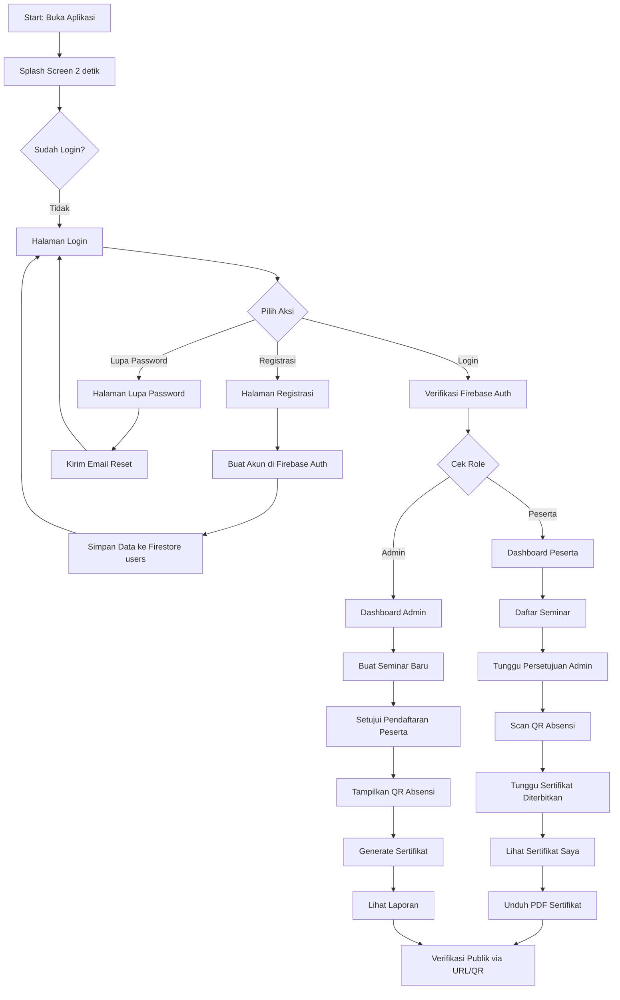
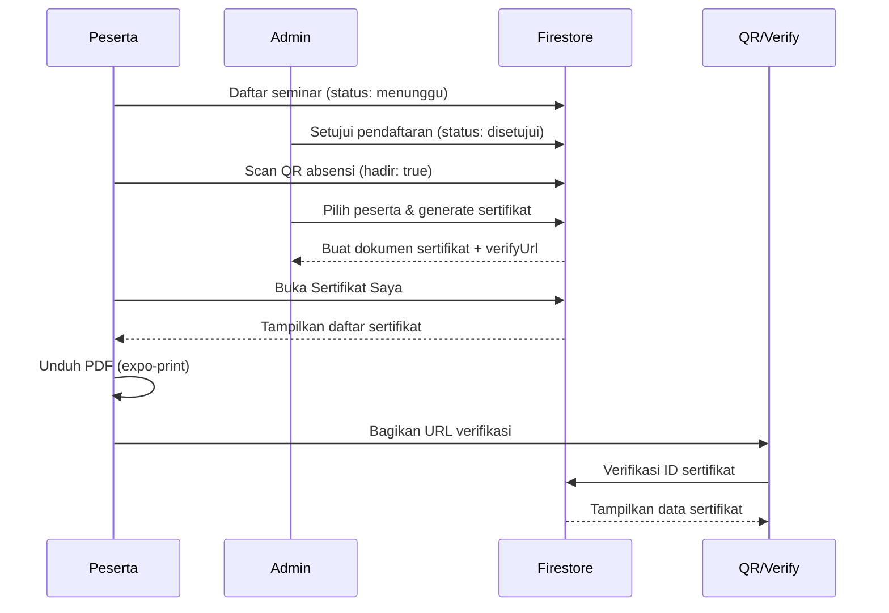

# LAPORAN DOKUMENTASI APLIKASI
## E-SERTIFIKAT

---

<div align="center">

**LAPORAN TUGAS PROYEK APLIKASI**

**APLIKASI E-SERTIFIKAT**
**(Sistem Manajemen Sertifikat Digital Berbasis Mobile)**

<br><br><br><br>

Disusun oleh:

Nama           : ____________________
NIM            : ____________________
Program Studi  : ____________________
Universitas    : ____________________

<br><br><br><br>

**Tahun 2026**

</div>

---

## DAFTAR ISI

1. Pendahuluan
   1.1 Latar Belakang
   1.2 Tujuan Pembuatan Aplikasi
   1.3 Tujuan Dokumentasi
   1.4 Ruang Lingkup
2. Gambaran Umum Aplikasi
3. Persyaratan Sistem
4. Instalasi Aplikasi
5. Panduan Penggunaan Aplikasi
   5.1 Halaman Splash Screen
   5.2 Halaman Login
   5.3 Halaman Registrasi
   5.4 Halaman Lupa Password
   5.5 Halaman Verifikasi Sertifikat
   5.6 Dashboard Peserta
   5.7 Daftar Seminar (Peserta)
   5.8 Seminar Saya (Peserta)
   5.9 Absensi Seminar (Peserta)
   5.10 Sertifikat Saya (Peserta)
   5.11 Detail & Unduh Sertifikat (Peserta)
   5.12 Profil Peserta
   5.13 Dashboard Admin
   5.14 Manajemen Seminar (Admin)
   5.15 Manajemen Pendaftaran (Admin)
   5.16 Absensi Seminar (Admin)
   5.17 Generate Sertifikat (Admin)
   5.18 Template Sertifikat (Admin)
   5.19 Laporan (Admin)
   5.20 Data Peserta (Admin)
   5.21 Data Narasumber (Admin)
   5.22 Profil Admin
   5.23 Pengaturan (Admin)
6. Penjelasan Seluruh Fitur
7. Struktur Project
8. Database
9. Alur Kerja Aplikasi
10. Pengujian
11. Kelebihan Aplikasi
12. Kekurangan Aplikasi
13. Saran Pengembangan
14. Kesimpulan

---

## BAB 1 — PENDAHULUAN

### 1.1 Latar Belakang

Dalam era digital saat ini, pengelolaan sertifikat pada kegiatan akademik seperti seminar, workshop, dan pelatihan masih banyak yang dilakukan secara manual. Proses manual ini menimbulkan beberapa permasalahan, antara lain lambatnya proses penerbitan sertifikat, sulitnya memverifikasi keaslian dokumen, serta rawan hilangnya data fisik. Selain itu, panitia kegiatan sering kali mengalami kesulitan dalam mengelola pendaftaran peserta, mencatat kehadiran, hingga menerbitkan sertifikat secara terpadu dalam satu sistem.

Berdasarkan permasalahan tersebut, dibangunlah sebuah aplikasi bernama **E-Sertifikat** yang bertujuan untuk mendigitalisasi seluruh alur kegiatan akademik, mulai dari pendaftaran peserta, pencatatan kehadiran melalui pemindaian kode QR, hingga penerbitan dan verifikasi sertifikat digital. Aplikasi ini dibangun menggunakan framework Expo (React Native) sehingga dapat berjalan pada platform Android, iOS, maupun Web dalam satu basis kode yang sama.

### 1.2 Tujuan Pembuatan Aplikasi

Tujuan pembuatan aplikasi E-Sertifikat adalah sebagai berikut:

1. Menyediakan platform terpadu untuk pengelolaan seminar atau kegiatan akademik, mulai dari pendaftaran peserta hingga penerbitan sertifikat.
2. Mempermudah panitia dalam mencatat kehadiran peserta melalui sistem pemindaian kode QR.
3. Mempercepat proses penerbitan sertifikat digital secara otomatis dan terverifikasi.
4. Menyediakan mekanisme verifikasi keaslian sertifikat melalui tautan publik dan kode QR.
5. Memberikan kemudahan bagi peserta untuk mendaftar seminar, melakukan absensi, serta mengunduh sertifikat dalam format PDF.

### 1.3 Tujuan Dokumentasi

Dokumentasi ini disusun dengan tujuan untuk:

1. Menjelaskan gambaran umum, fitur, dan cara penggunaan aplikasi E-Sertifikat secara menyeluruh.
2. Mendokumentasikan setiap halaman dan fitur yang terdapat pada aplikasi berdasarkan analisis kode sumber yang ada.
3. Menjelaskan struktur project, konfigurasi, serta alur kerja aplikasi.
4. Menyediakan panduan instalasi dan pengujian agar aplikasi dapat dijalankan dan dievaluasi.
5. Mengidentifikasi kelebihan, kekurangan, serta memberikan saran pengembangan untuk perbaikan ke depan.

### 1.4 Ruang Lingkup

Ruang lingkup dokumentasi ini meliputi seluruh kode sumber aplikasi E-Sertifikat yang tersedia pada repository, mencakup halaman autentikasi, halaman peserta, halaman admin, komponen pendukung, konfigurasi tema, serta integrasi Firebase. Dokumentasi ini tidak mencakup proses deployment ke produksi, konfigurasi server Firebase di sisi konsol, serta pengembangan fitur yang belum terimplementasi pada kode sumber.

---

## BAB 2 — GAMBARAN UMUM APLIKASI

### 2.1 Nama Aplikasi

Aplikasi ini bernama **E-Sertifikat** (ditulis dalam `app.json` pada field `name` dan `slug`), dengan tagline "Academic Excellence & Recognition" yang ditampilkan pada halaman Splash Screen.

### 2.2 Fungsi Utama

Aplikasi E-Sertifikat merupakan sistem manajemen sertifikat digital berbasis mobile yang memiliki dua perjalanan pengguna (user flow) yang berbeda, yaitu peran **Peserta** dan peran **Admin (Panitia)**. Fungsi utama aplikasi meliputi:

- **Autentikasi pengguna** melalui email dan kata sandi menggunakan Firebase Authentication.
- **Manajemen seminar** oleh admin, termasuk pembuatan, penyuntingan, dan penghapusan seminar beserta banner.
- **Pendaftaran peserta** ke seminar yang tersedia, dengan proses persetujuan oleh admin.
- **Pencatatan kehadiran** melalui pemindaian kode QR atau input kode manual.
- **Penerbitan sertifikat** secara otomatis oleh admin untuk peserta yang telah disetujui.
- **Unduh sertifikat** dalam format PDF oleh peserta, lengkap dengan tanda tangan digital, stempel, dan kode QR verifikasi.
- **Verifikasi keaslian sertifikat** melalui halaman publik yang dapat diakses tanpa login.

### 2.3 Target Pengguna

Aplikasi ini ditujukan untuk dua kelompok pengguna:

1. **Peserta** — mahasiswa atau peserta kegiatan akademik yang ingin mendaftar seminar, melakukan absensi, dan mengunduh sertifikat.
2. **Admin (Panitia)** — penyelenggara kegiatan akademik yang bertanggung jawab mengelola seminar, menyetujui pendaftaran, mengelola absensi, menerbitkan sertifikat, serta melihat laporan.

### 2.4 Teknologi yang Digunakan

| Kategori | Teknologi |
|---|---|
| Framework Utama | Expo SDK 54.0.0 (React Native 0.81.5) |
| Bahasa Pemrograman | TypeScript 5.9.2 |
| Navigasi | Expo Router 6.0.23 (file-based routing) |
| Backend & Database | Firebase (Authentication + Cloud Firestore) |
| Penyimpanan Gambar | Cloudinary (opsional, untuk banner seminar) |
| Pembuatan PDF | expo-print |
| Pemindaian QR | expo-camera (barcode scanner) |
| Pembuatan QR | react-native-qrcode-svg |
| Manajemen File | expo-file-system, expo-sharing, expo-intent-launcher |
| Pemilih Gambar | expo-image-picker |

### 2.5 Library Penting

Berikut adalah library penting yang digunakan dalam aplikasi beserta fungsinya:

| Library | Versi | Fungsi |
|---|---|---|
| `firebase` | ^12.15.0 | Autentikasi dan database Firestore |
| `firebase-admin` | ^13.10.0 | Admin SDK Firebase (untuk custom claims) |
| `expo-router` | ~6.0.23 | Navigasi berbasis file |
| `expo-camera` | ~17.0.10 | Akses kamera untuk pemindaian QR |
| `expo-print` | ~15.0.8 | Membuat file PDF sertifikat |
| `expo-file-system` | ~19.0.23 | Operasi baca/tulis file lokal |
| `expo-sharing` | ~14.0.8 | Membagikan file PDF |
| `expo-intent-launcher` | ~13.0.8 | Membuka file di aplikasi eksternal (Android) |
| `expo-image-picker` | ~17.0.11 | Memilih gambar dari galeri |
| `react-native-qrcode-svg` | ^6.3.21 | Membuat kode QR verifikasi |
| `react-native-reanimated` | ~4.1.1 | Animasi (splash screen) |
| `react-native-safe-area-context` | ~5.6.0 | Safe area untuk notch perangkat |
| `@expo/vector-icons` | ^15.0.3 | Ikon Ionicons dan MaterialIcons |

### 2.6 Database

Aplikasi menggunakan **Firebase Cloud Firestore** sebagai database utama. Firestore adalah database NoSQL berbasis dokumen yang menyimpan data dalam bentuk koleksi dan dokumen. Berikut adalah koleksi (collection) yang digunakan:

- `users` — menyimpan data pengguna (peserta dan admin).
- `seminar` — menyimpan data seminar/kegiatan.
- `pendaftaran` — menyimpan data pendaftaran peserta ke seminar.
- `absensi` — menyimpan data kehadiran peserta.
- `sertifikat` — menyimpan data sertifikat yang diterbitkan.
- `template_sertifikat` — menyimpan konfigurasi template sertifikat.

### 2.7 API

Aplikasi tidak menggunakan REST API eksternal secara langsung. Namun, aplikasi mengandalkan dua layanan pihak ketiga:

1. **Firebase API** — digunakan untuk autentikasi (Firebase Auth) dan operasi database (Cloud Firestore) melalui Firebase Client SDK.
2. **Cloudinary API** — digunakan untuk mengunggah banner seminar ke cloud storage (dipanggil melalui modul `config/cloudinary.ts`).

Selain itu, aplikasi memiliki satu endpoint publik untuk verifikasi sertifikat yang diakses melalui URL: `https://esertifikat.app/verify/{sertifikatId}`.

---

## BAB 3 — PERSYARATAN SISTEM

### 3.1 Software yang Dibutuhkan

| Software | Keterangan |
|---|---|
| Node.js | Versi 18 LTS atau lebih baru |
| npm atau yarn | Manajer paket (npm sudah terpasang bersama Node.js) |
| Git | Untuk meng-clone repository |
| Expo CLI | Terpasang otomatis melalui dependency proyek |
| Editor Kode | Visual Studio Code (direkomendasikan) dengan ekstensi Expo Tools |

### 3.2 Hardware Minimum

| Komponen | Minimum | Direkomendasikan |
|---|---|---|
| RAM | 4 GB | 8 GB atau lebih |
| Penyimpanan | 2 GB kosong | 5 GB kosong |
| Prosesor | Dual-core 1.6 GHz | Quad-core 2.0 GHz atau lebih |

Untuk pengujian pada perangkat mobile, dibutuhkan:
- Android: Android 8.0 (API 26) atau lebih baru.
- iOS: iOS 13 atau lebih baru (membutuhkan macOS dan Xcode).

### 3.3 Browser yang Didukung (Web)

Karena aplikasi dibangun dengan Expo yang mendukung output web, aplikasi dapat dijalankan pada peramban modern berikut:

- Google Chrome (versi terbaru)
- Mozilla Firefox (versi terbaru)
- Microsoft Edge (versi terbaru)
- Safari (versi terbaru)

### 3.4 Versi Dependency Penting

Berdasarkan berkas `package.json`, berikut adalah versi dependency utama yang digunakan:

| Dependency | Versi |
|---|---|
| expo | ~54.0.34 |
| react | 19.1.0 |
| react-native | 0.81.5 |
| expo-router | ~6.0.23 |
| firebase | ^12.15.0 |
| react-native-reanimated | ~4.1.1 |
| expo-camera | ~17.0.10 |
| expo-print | ~15.0.8 |

---

## BAB 4 — INSTALASI APLIKASI

### 4.1 Clone Repository

Langkah pertama adalah mengunduh (clone) repository proyek ke perangkat lokal menggunakan perintah berikut:

```bash
git clone <url-repository>
cd E-Sertifikat
```

### 4.2 Install Dependency

Setelah repository berhasil di-clone, pasang seluruh dependency yang dibutuhkan menggunakan perintah berikut:

```bash
npm install
```

Perintah ini akan membaca berkas `package.json` dan mengunduh seluruh paket yang tercantum ke dalam folder `node_modules`.

### 4.3 Konfigurasi Environment

Aplikasi ini membutuhkan konfigurasi Firebase dan Cloudinary agar dapat berjalan. Berdasarkan analisis kode sumber, terdapat dua berkas konfigurasi yang **diperlukan namun tidak tersedia** pada repository:

1. `config/firebase.ts` — berisi inisialisasi Firebase (apiKey, authDomain, projectId, dll.) dan ekspor objek `auth` dan `db`.
2. `config/cloudinary.ts` — berisi fungsi `uploadToCloudinary` untuk mengunggah gambar ke Cloudinary.

Pengguna perlu membuat folder `config/` di root proyek dan menambahkan berkas-berkas berikut:

**config/firebase.ts** (contoh struktur):
```typescript
import { initializeApp } from 'firebase/app';
import { getAuth } from 'firebase/auth';
import { getFirestore } from 'firebase/firestore';

const firebaseConfig = {
  apiKey: "YOUR_API_KEY",
  authDomain: "YOUR_PROJECT.firebaseapp.com",
  projectId: "YOUR_PROJECT_ID",
  storageBucket: "YOUR_PROJECT.appspot.com",
  messagingSenderId: "YOUR_SENDER_ID",
  appId: "YOUR_APP_ID",
};

const app = initializeApp(firebaseConfig);
export const auth = getAuth(app);
export const db = getFirestore(app);
```

**config/cloudinary.ts** (contoh struktur):
```typescript
export async function uploadToCloudinary(uri: string, folder: string) {
  // Implementasi upload ke Cloudinary
  // Mengembalikan { secure_url, public_id }
}
```

Selain itu, terdapat berkas `.env` di root proyek yang berisi konfigurasi Supabase, namun berdasarkan analisis kode sumber, aplikasi **tidak menggunakan Supabase** melainkan Firebase. Berkas `.env` ini tidak direferensikan dalam kode aplikasi dan dapat diabaikan.

### 4.4 Menjalankan Aplikasi

Setelah konfigurasi selesai, jalankan aplikasi dalam mode pengembangan dengan perintah:

```bash
npx expo start
```

Perintah ini akan memulai Metro Bundler dan menampilkan QR code serta opsi untuk membuka aplikasi pada:
- Android Emulator (tekan tombol `a`)
- iOS Simulator (tekan tombol `i`, hanya di macOS)
- Web Browser (tekan tombol `w`)
- Expo Go di perangkat fisik (scan QR code)

### 4.5 Build Aplikasi

Untuk membangun aplikasi menjadi paket yang siap dipasang, gunakan Expo Application Services (EAS):

```bash
# Install EAS CLI
npm install -g eas-cli

# Login ke Expo account
eas login

# Konfigurasi build pertama kali
eas build:configure

# Build untuk Android
eas build --platform android

# Build untuk iOS
eas build --platform ios
```

### 4.6 Menjalankan Mode Production

Untuk menjalankan aplikasi dalam mode produksi secara lokal:

```bash
npx expo start --no-dev --minify
```

Untuk membuat bundle web statis (sesuai konfigurasi `app.json` dengan `web.output: "static"`):

```bash
npx expo export
```

Hasil build web akan tersimpan di folder `dist/`.

---

## BAB 5 — PANDUAN PENGGUNAAN APLIKASI

Bab ini menjelaskan setiap halaman yang terdapat pada aplikasi E-Sertifikat berdasarkan analisis kode sumber. Aplikasi memiliki tiga kelompok halaman utama: halaman autentikasi, halaman peserta, dan halaman admin.

> **Catatan Penting:** Berdasarkan hasil pemeriksaan tipe (typecheck), aplikasi **tidak dapat dijalankan** pada saat dokumentasi ini disusun karena berkas konfigurasi `config/firebase.ts` dan `config/cloudinary.ts` tidak tersedia pada repository. Oleh karena itu, screenshot pada bab ini ditandai sebagai **placeholder** dan perlu diambil setelah berkas konfigurasi ditambahkan dan aplikasi berhasil dijalankan.

---

### 5.1 Halaman Splash Screen

**Fungsi halaman:**
Halaman Splash Screen adalah halaman pembuka yang ditampilkan saat aplikasi pertama kali dijalankan. Halaman ini menampilkan logo aplikasi dengan animasi mengambang (floating animation), nama brand "E-Sertifikat", tagline "Academic Excellence & Recognition", serta dekorasi berupa dua lingkaran bertitik-titik di latar belakang. Halaman ini berfungsi sebagai transisi visual selama aplikasi memuat sumber daya awal.

**Cara mengakses:**
Halaman ini otomatis ditampilkan saat pengguna membuka aplikasi. Setelah 2 detik, pengguna akan diarahkan otomatis ke halaman Login.

**Komponen yang tersedia:**
- Logo aplikasi (gambar `assets/logo.png`)
- Animasi mengambang (Animated.View dengan Animated.loop)
- Dekorasi lingkaran luar dan dalam (outer ring & inner ring)
- Teks nama brand "E-Sertifikat"
- Teks tagline "ACADEMIC EXCELLENCE & RECOGNITION"
- Garis dekoratif di bagian bawah
- Teks footer "PROFESSIONAL CREDENTIALING PORTAL"
- Status bar (expo-status-bar)

**Cara penggunaan:**
1. Pengguna membuka aplikasi.
2. Halaman Splash Screen ditampilkan dengan logo yang bergerak naik-turun secara halus.
3. Pengguna menunggu selama 2 detik.
4. Aplikasi secara otomatis berpindah ke halaman Login.

**Hasil yang diperoleh:**
Pengguna melihat tampilan pembuka aplikasi yang elegan, kemudian otomatis diarahkan ke halaman Login untuk memulai sesi.

**Screenshot:**

> *[Placeholder]* — Gambar 5.1 Halaman Splash Screen

---

### 5.2 Halaman Login

**Fungsi halaman:**
Halaman Login berfungsi sebagai gerbang masuk bagi pengguna yang sudah memiliki akun. Halaman ini memverifikasi kredensial pengguna (email dan kata sandi) melalui Firebase Authentication, kemudian menentukan peran pengguna (admin atau peserta) berdasarkan custom claims atau data di koleksi `users` di Firestore, dan mengarahkan pengguna ke dashboard yang sesuai.

**Cara mengakses:**
Halaman ini ditampilkan otomatis setelah Splash Screen selesai, atau dapat diakses melalui rute `/login`.

**Komponen yang tersedia:**
- Logo aplikasi
- Judul "Welcome Back" dan subjudul "Sign in to access your certificates"
- Input email dengan ikon surat (mail-outline)
- Input kata sandi dengan ikon gembok (lock-closed-outline)
- Tombol mata (eye-outline) untuk menampilkan/menyembunyikan kata sandi
- Tautan "Forgot Password?" yang mengarah ke halaman Lupa Password
- Tombol "Sign In"
- Tautan "Register Now" di bagian bawah yang mengarah ke halaman Registrasi
- Indikator loading (ActivityIndicator) saat proses login berlangsung
- Dukungan mode gelap/terang (dark/light mode) berdasarkan sistem

**Cara penggunaan:**
1. Pengguna memasukkan alamat email pada kolom "Email Address".
2. Pengguna memasukkan kata sandi pada kolom "Password".
3. Jika ingin melihat kata sandi, pengguna dapat menekan ikon mata di sisi kanan kolom kata sandi.
4. Pengguna menekan tombol "Sign In".
5. Sistem memverifikasi kredensial melalui Firebase Authentication.
6. Jika berhasil, sistem memeriksa peran pengguna (admin atau peserta).
7. Jika admin, pengguna diarahkan ke `/admin/dashboard`. Jika peserta, diarahkan ke `/peserta/dashboard`.
8. Jika gagal, sistem menampilkan pesan error yang sesuai.

**Hasil yang diperoleh:**
Pengguna yang berhasil login akan masuk ke dashboard sesuai perannya. Pengguna yang gagal login akan melihat pesan error seperti "Email atau password salah" atau "Koneksi internet bermasalah".

**Screenshot:**

> *[Placeholder]* — Gambar 5.2 Halaman Login

---

### 5.3 Halaman Registrasi

**Fungsi halaman:**
Halaman Registrasi berfungsi untuk membuat akun baru bagi peserta. Halaman ini menerima data nama lengkap, email, kata sandi, dan konfirmasi kata sandi, kemudian membuat akun baru melalui Firebase Authentication dan menyimpan data pengguna ke koleksi `users` di Firestore dengan peran default "peserta".

**Cara mengakses:**
Pengguna menekan tautan "Register Now" pada halaman Login, atau melalui rute `/register`.

**Komponen yang tersedia:**
- Tombol kembali (arrow-back) di pojok kiri atas
- Judul "Create Account" dan subjudul "Sign up to start tracking achievements"
- Input nama lengkap dengan ikon person (person-outline)
- Input email dengan ikon surat (mail-outline)
- Input kata sandi dengan ikon gembok dan tombol mata
- Input konfirmasi kata sandi dengan ikon gembok
- Tombol "Sign Up"
- Tautan "Sign In" di bagian bawah untuk kembali ke halaman Login
- Indikator loading saat proses registrasi

**Cara penggunaan:**
1. Pengguna menekan tombol kembali atau tautan "Register Now" dari halaman Login.
2. Pengguna memasukkan nama lengkap.
3. Pengguna memasukkan alamat email.
4. Pengguna memasukkan kata sandi (minimal 6 karakter).
5. Pengguna memasukkan ulang kata sandi pada kolom konfirmasi.
6. Pengguna menekan tombol "Sign Up".
7. Sistem membuat akun di Firebase Auth dan menyimpan data ke Firestore.
8. Jika berhasil, muncul pesan "Akun Anda telah berhasil dibuat!" dan pengguna diarahkan ke halaman Login.

**Hasil yang diperoleh:**
Akun baru berhasil dibuat dengan peran "peserta". Pengguna dapat login menggunakan email dan kata sandi yang telah didaftarkan.

**Screenshot:**

> *[Placeholder]* — Gambar 5.3 Halaman Registrasi

---

### 5.4 Halaman Lupa Password

**Fungsi halaman:**
Halaman Lupa Password berfungsi untuk mengirim tautan reset kata sandi ke email pengguna yang lupa kata sandinya. Halaman ini menggunakan fungsi `sendPasswordResetEmail` dari Firebase Authentication.

**Cara mengakses:**
Pengguna menekan tautan "Forgot Password?" pada halaman Login, atau melalui rute `/lupa_password`.

**Komponen yang tersedia:**
- Tombol kembali (arrow-back)
- Judul "Reset Password" dan subjudul dinamis
- Input email dengan ikon surat
- Tombol "Send Reset Link"
- Tampilan sukses dengan ikon checkmark (checkmark-circle-outline) setelah email terkirim
- Tombol "Back to Sign In" setelah pengiriman berhasil

**Cara penggunaan:**
1. Pengguna menekan tautan "Forgot Password?" pada halaman Login.
2. Pengguna memasukkan alamat email yang terdaftar.
3. Pengguna menekan tombol "Send Reset Link".
4. Sistem mengirim email reset password melalui Firebase.
5. Halaman berubah menampilkan pesan sukses "Request Sent!".
6. Pengguna menekan tombol "Back to Sign In" untuk kembali ke halaman Login.

**Hasil yang diperoleh:**
Email berisi tautan reset kata sandi dikirim ke alamat email pengguna. Pengguna dapat mengikuti tautan tersebut untuk mengatur ulang kata sandinya.

**Screenshot:**

> *[Placeholder]* — Gambar 5.4 Halaman Lupa Password

---

### 5.5 Halaman Verifikasi Sertifikat

**Fungsi halaman:**
Halaman Verifikasi Sertifikat adalah halaman publik yang dapat diakses tanpa login. Halaman ini berfungsi untuk memverifikasi keaslian sertifikat berdasarkan ID sertifikat yang tertera pada kode QR. Halaman ini mengambil data dari koleksi `sertifikat` di Firestore dan menampilkan informasi sertifikat beserta status verifikasinya.

**Cara mengakses:**
Halaman ini diakses melalui URL publik: `https://esertifikat.app/verify/{sertifikatId}`, atau melalui rute `/verify/[id]` dengan parameter ID sertifikat.

**Komponen yang tersedia:**
- Header verifikasi dengan ikon perisai (shield-checkmark) berwarna hijau
- Judul "Sertifikat Terverifikasi"
- Pratinjau sertifikat (jika `imageUrl` tersedia, ditampilkan sebagai gambar; jika tidak, ditampilkan sebagai kartu pratinjau)
- Kartu informasi detail (ID Sertifikat, Nama Peserta, Seminar, Tanggal Terbit)
- Tampilan "Tidak Ditemukan" jika ID tidak valid
- Indikator loading saat verifikasi

**Cara penggunaan:**
1. Pihak yang ingin memverifikasi membuka tautan dari kode QR pada sertifikat.
2. Sistem mencari data sertifikat berdasarkan ID di Firestore.
3. Jika ditemukan, halaman menampilkan informasi sertifikat dengan status "Terverifikasi".
4. Jika tidak ditemukan, halaman menampilkan pesan "Sertifikat Tidak Ditemukan".

**Hasil yang diperoleh:**
Pihak verifikator dapat memastikan keaslian sertifikat beserta detail informasi pemilik sertifikat.

**Screenshot:**

> *[Placeholder]* — Gambar 5.5 Halaman Verifikasi Sertifikat

---

### 5.6 Dashboard Peserta

**Fungsi halaman:**
Halaman Dashboard Peserta adalah halaman utama bagi pengguna dengan peran peserta. Halaman ini menampilkan sambutan personal, statistik ringkas (jumlah seminar terdaftar dan sertifikat diterima), daftar seminar yang tersedia, serta sertifikat terbaru yang dapat diunduh.

**Cara mengakses:**
Setelah login sebagai peserta, pengguna otomatis diarahkan ke `/peserta/dashboard`. Halaman ini juga dapat diakses melalui tab "Beranda" di navigasi bawah.

**Komponen yang tersedia:**
- Header bar dengan avatar dan judul "Seminar Portal"
- Tombol logout (log-out-outline) di pojok kanan atas
- Teks sambutan "Selamat Datang," dan nama pengguna
- Dua kartu statistik (Seminar Terdaftar, Sertifikat Diterima)
- Bagian "Seminar Tersedia" dengan tautan "Lihat Semua"
- Daftar kartu seminar (maksimal 3) dengan ikon dan metadata
- Bagian "Sertifikat Terbaru" dengan tautan "Lihat Semua"
- Kartu pratinjau sertifikat terbaru dengan tombol "Lihat & Unduh"
- Navigasi bawah (Beranda, Seminar, Absensi, Profil)

**Cara penggunaan:**
1. Peserta login dan masuk ke dashboard.
2. Peserta melihat statistik jumlah seminar dan sertifikat.
3. Peserta dapat menekan "Lihat Semua" untuk melihat daftar seminar lengkap.
4. Peserta dapat menekan kartu sertifikat terbaru untuk mengunduh sertifikat.
5. Peserta dapat menekan tombol logout untuk keluar dari sesi.

**Hasil yang diperoleh:**
Peserta mendapatkan ringkasan aktivitas akademiknya dan akses cepat ke seminar serta sertifikat.

**Screenshot:**

> *[Placeholder]* — Gambar 5.6 Dashboard Peserta

---

### 5.7 Daftar Seminar (Peserta)

**Fungsi halaman:**
Halaman Daftar Seminar menampilkan seluruh seminar yang tersedia (berstatus "aktif" atau "selesai") untuk didaftarkan oleh peserta. Peserta dapat mencari seminar berdasarkan judul atau narasumber, dan mendaftar seminar yang masih aktif.

**Cara mengakses:**
Pengguna menekan "Lihat Semua" pada bagian Seminar Tersedia di Dashboard Peserta, atau melalui tab navigasi atau rute `/peserta/daftar_seminar`.

**Komponen yang tersedia:**
- Header dengan judul "Daftar Seminar" dan tombol kembali
- Kolom pencarian dengan ikon search
- Kartu seminar dengan gambar banner, badge status, judul, narasumber, tanggal
- Tombol "Daftar Sekarang" / "Terdaftar" / "Seminar Selesai"
- Komponen EmptyState jika tidak ada seminar

**Cara penggunaan:**
1. Peserta membuka halaman Daftar Seminar.
2. Peserta dapat menggunakan kolom pencarian untuk mencari seminar.
3. Peserta menekan tombol "Daftar Sekarang" pada seminar yang ingin diikuti.
4. Sistem membuat dokumen pendaftaran dengan status "menunggu" di Firestore.
5. Tombol berubah menjadi "Terdaftar" dan muncul pesan konfirmasi.

**Hasil yang diperoleh:**
Peserta terdaftar pada seminar dengan status "menunggu" persetujuan admin. Setelah disetujui, peserta dapat melakukan absensi.

**Screenshot:**

> *[Placeholder]* — Gambar 5.7 Halaman Daftar Seminar

---

### 5.8 Seminar Saya (Peserta)

**Fungsi halaman:**
Halaman Seminar Saya menampilkan daftar seminar yang telah didaftarkan oleh peserta, dibagi menjadi dua tab: "Akan Datang" (seminar aktif) dan "Selesai" (seminar yang sudah berakhir). Halaman ini juga menampilkan status absensi peserta untuk setiap seminar.

**Cara mengakses:**
Pengguna menekan tab "Seminar" di navigasi bawah, atau melalui rute `/peserta/seminar_saya`.

**Komponen yang tersedia:**
- Header dengan judul "Seminar Saya"
- Tab "Akan Datang" dan "Selesai"
- Kartu seminar dengan gambar, badge status, judul, tanggal
- Tombol "Lakukan Absensi" (jika belum absen dan seminar aktif)
- Indikator "Absensi tercatat" (jika sudah absen)
- Tombol "Lihat Sertifikat" (jika seminar selesai)
- Komponen EmptyState

**Cara penggunaan:**
1. Peserta membuka tab "Seminar" di navigasi bawah.
2. Peserta memilih tab "Akan Datang" atau "Selesai".
3. Pada tab "Akan Datang", peserta dapat menekan "Lakukan Absensi" untuk seminar yang belum diabsen.
4. Pada tab "Selesai", peserta dapat menekan "Lihat Sertifikat" untuk seminar yang sudah selesai.

**Hasil yang diperoleh:**
Peserta dapat melihat status pendaftaran dan absensi untuk setiap seminar, serta mengakses sertifikat untuk seminar yang sudah selesai.

**Screenshot:**

> *[Placeholder]* — Gambar 5.8 Halaman Seminar Saya

---

### 5.9 Absensi Seminar (Peserta)

**Fungsi halaman:**
Halaman Absensi Seminar berfungsi untuk mencatat kehadiran peserta pada seminar. Peserta dapat melakukan absensi melalui dua cara: memindai kode QR yang ditampilkan panitia menggunakan kamera perangkat, atau memasukkan kode absensi manual (format: `ABSEN-{seminarId}`).

**Cara mengakses:**
Pengguna menekan tombol "Lakukan Absensi" pada halaman Seminar Saya, atau melalui tab "Absensi" di navigasi bawah, atau rute `/peserta/absensi`.

**Komponen yang tersedia:**
- Header dengan judul "Absensi Seminar" dan tombol kembali
- Tampilan kamera dengan overlay viewfinder (kotak dengan sudut emas)
- Teks petunjuk "Posisikan QR di dalam kotak"
- Permintaan izin kamera dengan tombol "Izinkan Akses Kamera"
- Pemisah "ATAU MASUKKAN KODE MANUAL"
- Input kode manual dengan placeholder "Contoh: ABSEN-abc123"
- Tombol "Konfirmasi Kehadiran"
- Tampilan sukses dengan ikon checkmark dan info waktu absen
- Tampilan error dengan ikon X dan pesan error
- Tombol "Absen Seminar Lain" / "Coba Lagi" untuk reset

**Cara penggunaan:**
1. Peserta membuka halaman Absensi.
2. Jika menggunakan QR: arahkan kamera ke kode QR yang ditampilkan panitia.
3. Jika menggunakan kode manual: ketik kode absensi (contoh: `ABSEN-abc123`) dan tekan "Konfirmasi Kehadiran".
4. Sistem memverifikasi kode, mengecek status seminar, dan mengecek apakah peserta sudah pernah absen.
5. Jika valid dan belum absen, sistem mencatat kehadiran ke Firestore.
6. Tampilan sukses muncul dengan nama seminar dan waktu absen.

**Hasil yang diperoleh:**
Peserta tercatat hadir pada seminar. Data absensi tersimpan di koleksi `absensi` dengan field `hadir: true` dan waktu absen.

**Screenshot:**

> *[Placeholder]* — Gambar 5.9 Halaman Absensi Seminar (Peserta)

---

### 5.10 Sertifikat Saya (Peserta)

**Fungsi halaman:**
Halaman Sertifikat Saya menampilkan daftar seluruh sertifikat yang telah diterbitkan untuk peserta yang sedang login. Setiap kartu sertifikat menampilkan judul seminar, tanggal terbit, dan ID sertifikat.

**Cara mengakses:**
Pengguna menekan "Lihat Semua" pada bagian Sertifikat Terbaru di Dashboard, atau melalui rute `/peserta/sertifikat`.

**Komponen yang tersedia:**
- Header dengan judul "Sertifikat Saya"
- Kartu ringkasan dengan jumlah total sertifikat
- Daftar kartu sertifikat dengan ikon pita (ribbon), judul seminar, tanggal terbit, ID sertifikat
- Ikon panah (chevron-forward) untuk membuka detail
- Komponen EmptyState jika belum ada sertifikat

**Cara penggunaan:**
1. Peserta membuka halaman Sertifikat Saya.
2. Peserta melihat jumlah total sertifikat di kartu ringkasan.
3. Peserta menekan salah satu kartu sertifikat untuk membuka halaman detail dan unduh.

**Hasil yang diperoleh:**
Peserta dapat melihat seluruh sertifikat yang dimiliki dan mengakses detailnya untuk diunduh.

**Screenshot:**

> *[Placeholder]* — Gambar 5.10 Halaman Sertifikat Saya

---

### 5.11 Detail & Unduh Sertifikat (Peserta)

**Fungsi halaman:**
Halaman Detail & Unduh Sertifikat menampilkan pratinjau lengkap sertifikat beserta tombol untuk mengunduh dalam format PDF dan membagikannya. Sertifikat yang diunduh berisi latar belakang sertifikat, nama peserta, judul seminar, tanda tangan digital (maksimal 3), stempel, dan kode QR verifikasi.

**Cara mengakses:**
Pengguna menekan kartu sertifikat pada halaman Sertifikat Saya atau Dashboard, melalui rute `/peserta/download_sertifikat` dengan parameter `id`.

**Komponen yang tersedia:**
- Header dengan judul "Detail Sertifikat" dan tombol kembali
- Pratinjau sertifikat dengan latar belakang (bg_sertifikat.png)
- Logo sertifikat, judul "SERTIFIKAT", nama peserta, judul seminar
- Tanda tangan digital (gambar tanda_tangan.png, tanda_tangan2.png, tanda_tangan3.png)
- Stempel (stempel.png)
- Kode QR verifikasi dengan ID sertifikat dan URL verifikasi
- Kartu informasi (ID Sertifikat, Tanggal Terbit, Status Verifikasi)
- Tombol "Bagikan" (share-social-outline)
- Tombol "Unduh PDF" (download-outline) dengan indikator loading

**Cara penggunaan:**
1. Peserta membuka detail sertifikat dari halaman Sertifikat Saya.
2. Peserta melihat pratinjau sertifikat dengan seluruh elemen visual.
3. Peserta menekan tombol "Unduh PDF" untuk mengunduh.
4. Sistem membuat HTML sertifikat, mengonversi gambar ke base64, lalu membuat PDF menggunakan expo-print.
5. Pada Android, pengguna diminta memilih folder penyimpanan (disarankan folder Download).
6. Pada iOS, share sheet ditampilkan untuk menyimpan atau membuka PDF.
7. Peserta dapat menekan "Bagikan" untuk membagikan tautan verifikasi.

**Hasil yang diperoleh:**
File PDF sertifikat tersimpan di perangkat peserta dengan nama format `Sertifikat {Judul Seminar} - {Nama Peserta}.pdf`. Tautan verifikasi dapat dibagikan kepada pihak lain.

**Screenshot:**

> *[Placeholder]* — Gambar 5.11 Halaman Detail & Unduh Sertifikat

---

### 5.12 Profil Peserta

**Fungsi halaman:**
Halaman Profil Peserta menampilkan identitas pengguna, statistik aktivitas (seminar diikuti, sertifikat, persentase kehadiran), serta menu navigasi ke halaman-halaman terkait. Peserta juga dapat mengubah nama akunnya pada halaman ini.

**Cara mengakses:**
Pengguna menekan tab "Profil" di navigasi bawah, atau melalui rute `/peserta/profil`.

**Komponen yang tersedia:**
- Header dengan judul "Profil Saya"
- Kartu identitas dengan avatar, nama, email, dan badge "Peserta Aktif"
- Kartu edit nama akun dengan input dan tombol "Simpan Nama"
- Baris statistik (Seminar Diikuti, Sertifikat, Kehadiran)
- Daftar menu: Seminar Saya, Sertifikat Saya, Cari Seminar Baru, Pusat Bantuan, Keluar
- Teks versi aplikasi
- Pull-to-refresh untuk memuat ulang statistik

**Cara penggunaan:**
1. Peserta membuka tab "Profil".
2. Peserta melihat identitas dan statistiknya.
3. Untuk mengubah nama, peserta mengedit input nama dan menekan "Simpan Nama".
4. Peserta dapat menekan menu untuk navigasi ke halaman terkait.
5. Peserta menekan "Keluar" untuk logout dari sesi.

**Hasil yang diperoleh:**
Peserta dapat melihat dan mengubah profilnya, serta menavigasi ke fitur-fitur lain dari halaman profil.

**Screenshot:**

> *[Placeholder]* — Gambar 5.12 Halaman Profil Peserta

---

### 5.13 Dashboard Admin

**Fungsi halaman:**
Halaman Dashboard Admin adalah halaman utama bagi pengguna dengan peran admin. Halaman ini menampilkan ringkasan statistik (total seminar, total peserta, sertifikat terbit, kehadiran rata-rata), menu cepat, serta daftar seminar yang sedang berjalan.

**Cara mengakses:**
Setelah login sebagai admin, pengguna otomatis diarahkan ke `/admin/dashboard`. Halaman ini juga dapat diakses melalui tab "Beranda" di navigasi bawah admin.

**Komponen yang tersedia:**
- Header bar dengan brand "E-Sertifikat" dan avatar admin (tekan untuk logout)
- Judul "Ringkasan Statistik" dan deskripsi
- Grid 2x2 kartu statistik (Total Seminar, Total Peserta, Sertifikat Terbit, Kehadiran Rata-rata)
- Bagian "Menu Cepat" dengan 4 kartu: Pendaftaran, Sertifikat, Absensi, Laporan
- Bagian "Seminar Berjalan" dengan kartu seminar (gambar, badge status, judul, peserta, tanggal, avatar stack, tombol "Kelola")
- Navigasi bawah admin (Beranda, Pendaftaran, Seminar, Profil)
- Pull-to-refresh untuk memuat ulang statistik

**Cara penggunaan:**
1. Admin login dan masuk ke dashboard.
2. Admin melihat ringkasan statistik keseluruhan sistem.
3. Admin menekan kartu menu cepat untuk mengakses fitur terkait.
4. Admin dapat menekan avatar di pojok kanan atas untuk logout.
5. Admin dapat menarik ke bawah (pull-to-refresh) untuk memperbarui data.

**Hasil yang diperoleh:**
Admin mendapatkan gambaran umum performa sistem dan akses cepat ke seluruh fitur manajemen.

**Screenshot:**

> *[Placeholder]* — Gambar 5.13 Dashboard Admin

---

### 5.14 Manajemen Seminar (Admin)

**Fungsi halaman:**
Halaman Manajemen Seminar berfungsi untuk membuat, menyunting, dan menghapus seminar. Admin dapat mengunggah banner seminar, mengatur status (aktif, draft, selesai), serta melihat daftar seminar dengan filter berdasarkan status.

**Cara mengakses:**
Pengguna menekan tab "Seminar" di navigasi bawah admin, atau melalui rute `/admin/seminar`.

**Komponen yang tersedia:**
- Header bar dengan brand dan avatar
- Filter pill (Semua, Aktif, Selesai)
- Kartu seminar dengan gambar, badge status, judul, narasumber, tanggal, avatar stack peserta
- Tombol edit (pencil-outline) dan hapus (trash-outline) pada setiap kartu
- Kartu "Buat Seminar Baru" dengan ikon plus
- Tombol FAB (floating action button) untuk membuat seminar baru
- Paginasi (tombol halaman 1, 2, 3)
- Modal form pembuatan/edit seminar dengan field: Judul, Narasumber, Tanggal & Waktu, Status, Keterangan Status, Banner
- Pemilih banner dari galeri (expo-image-picker)
- Tombol "Buat Seminar" / "Simpan Perubahan" dan "Batal"

**Cara penggunaan:**
1. Admin membuka tab "Seminar".
2. Admin dapat memfilter seminar berdasarkan status.
3. Untuk membuat seminar baru, admin menekan tombol FAB atau kartu "Buat Seminar Baru".
4. Admin mengisi form: judul, narasumber, tanggal, status, dan memilih banner dari galeri.
5. Admin menekan "Buat Seminar" untuk menyimpan.
6. Untuk mengedit, admin menekan ikon pensil pada kartu seminar.
7. Untuk menghapus, admin menekan ikon tempat sampah dan mengonfirmasi.

**Hasil yang diperoleh:**
Seminar baru tersimpan di koleksi `seminar` di Firestore. Banner diunggah ke Cloudinary (jika dikonfigurasi) atau menggunakan gambar default.

**Screenshot:**

> *[Placeholder]* — Gambar 5.14 Halaman Manajemen Seminar

> *[Placeholder]* — Gambar 5.15 Modal Form Seminar

---

### 5.15 Manajemen Pendaftaran (Admin)

**Fungsi halaman:**
Halaman Manajemen Pendaftaran berfungsi untuk menyetujui atau menolak pendaftaran peserta ke seminar. Halaman ini menampilkan daftar pendaftaran dalam tiga tab: Menunggu, Disetujui, dan Ditolak.

**Cara mengakses:**
Pengguna menekan tab "Pendaftaran" di navigasi bawah admin, atau melalui rute `/admin/pendaftaran`.

**Komponen yang tersedia:**
- Header dengan judul "Pendaftaran" dan tombol kembali
- Tab bar dengan tiga tab (Menunggu, Disetujui, Ditolak) beserta jumlah masing-masing
- Kartu pendaftaran dengan avatar inisial, nama peserta, email, nama seminar, tanggal daftar, badge status
- Tombol "Tolak" dan "Setujui" pada tab Menunggu
- Indikator loading saat memperbarui status
- Pull-to-refresh
- Komponen EmptyState

**Cara penggunaan:**
1. Admin membuka tab "Pendaftaran".
2. Admin memilih tab "Menunggu" untuk melihat pendaftaran yang perlu ditinjau.
3. Admin menekan "Setujui" untuk menyetujui pendaftaran peserta.
4. Admin menekan "Tolak" untuk menolak pendaftaran peserta.
5. Sistem memperbarui status di Firestore secara real-time.

**Hasil yang diperoleh:**
Status pendaftaran peserta berubah menjadi "disetujui" atau "ditolak". Peserta yang disetujui dapat melakukan absensi dan menerima sertifikat.

**Screenshot:**

> *[Placeholder]* — Gambar 5.16 Halaman Manajemen Pendaftaran

---

### 5.16 Absensi Seminar (Admin)

**Fungsi halaman:**
Halaman Absensi Seminar (Admin) berfungsi untuk menampilkan kode QR absensi yang dapat dipindai oleh peserta, serta memantau daftar kehadiran peserta secara real-time. Admin dapat memilih seminar aktif dan membagikan kode absensi.

**Cara mengakses:**
Pengguna menekan tombol "Absensi" pada menu cepat di Dashboard Admin, atau melalui rute `/admin/absensi`.

**Komponen yang tersedia:**
- Header dengan judul "Absensi Seminar", tombol kembali, dan tombol QR (qr-code-outline)
- Pemilih seminar aktif (horizontal scroll chip)
- Kartu QR Absensi dengan pratinjau kode QR, kode absensi, dan tombol bagikan
- Kartu ringkasan kehadiran (persentase, jumlah hadir, belum hadir)
- Daftar kehadiran dengan avatar inisial, nama, waktu absen, badge status
- Modal QR besar dengan kode QR, nama seminar, tanggal, kode absensi, tombol "Bagikan Kode" dan "Tutup"
- Listener real-time (onSnapshot) untuk pembaruan kehadiran

**Cara penggunaan:**
1. Admin membuka halaman Absensi dari menu cepat.
2. Admin memilih seminar aktif dari daftar chip.
3. Admin menekan kartu QR atau tombol QR di header untuk menampilkan QR besar.
4. Admin menampilkan QR kepada peserta untuk dipindai.
5. Admin dapat menekan "Bagikan Kode" untuk membagikan kode absensi via pesan.
6. Daftar kehadiran diperbarui secara real-time saat peserta melakukan absensi.

**Hasil yang diperoleh:**
Admin dapat memantau kehadiran peserta secara langsung dan menampilkan kode QR untuk absensi.

**Screenshot:**

> *[Placeholder]* — Gambar 5.17 Halaman Absensi Seminar (Admin)

> *[Placeholder]* — Gambar 5.18 Modal QR Code Absensi

---

### 5.17 Generate Sertifikat (Admin)

**Fungsi halaman:**
Halaman Generate Sertifikat berfungsi untuk menerbitkan sertifikat bagi peserta yang pendaftarannya telah disetujui. Admin dapat memilih seminar, melihat daftar peserta yang eligible, memilih peserta, dan menerbitkan sertifikat secara massal.

**Cara mengakses:**
Pengguna menekan tombol "Sertifikat" pada menu cepat di Dashboard Admin, atau melalui rute `/admin/generate_sertifikat`.

**Komponen yang tersedia:**
- Header dengan judul "Generate Sertifikat", tombol kembali, dan tombol template (ribbon-outline)
- Peringatan template jika belum diisi (alert-circle-outline)
- Info template aktif dengan tautan "Edit"
- Pemilih seminar (horizontal scroll chip)
- Kartu pratinjau sertifikat
- Header daftar peserta dengan tombol "Pilih Semua"
- Kartu peserta dengan checkbox, avatar inisial, nama, email, status absen, badge "Terbit"/"Belum"
- Bar footer dengan jumlah peserta dipilih dan tombol "Terbitkan Sertifikat"
- Indikator loading saat generate

**Cara penggunaan:**
1. Admin membuka halaman Generate Sertifikat.
2. Admin memastikan template sertifikat sudah diisi (jika belum, admin diarahkan ke halaman Template).
3. Admin memilih seminar dari daftar chip.
4. Sistem menampilkan daftar peserta yang disetujui untuk seminar tersebut.
5. Admin mencentang peserta yang akan diterbitkan sertifikatnya, atau menekan "Pilih Semua".
6. Admin menekan tombol "Terbitkan Sertifikat".
7. Sistem membuat dokumen sertifikat di Firestore untuk setiap peserta terpilih.
8. Muncul pesan konfirmasi jumlah sertifikat yang berhasil diterbitkan.

**Hasil yang diperoleh:**
Sertifikat diterbitkan untuk peserta terpilih. Setiap sertifikat memiliki ID unik, URL verifikasi, dan data penandatangan dari template. Peserta dapat melihat sertifikat di menu Sertifikat Saya.

**Screenshot:**

> *[Placeholder]* — Gambar 5.19 Halaman Generate Sertifikat

---

### 5.18 Template Sertifikat (Admin)

**Fungsi halaman:**
Halaman Template Sertifikat berfungsi untuk mengonfigurasi konten dan tampilan sertifikat yang akan diterbitkan. Admin dapat mengatur judul acara, penandatangan (maksimal 3), file tanda tangan, serta menampilkan/menyembunyikan kode QR verifikasi.

**Cara mengakses:**
Pengguna menekan tombol template (ribbon-outline) pada halaman Generate Sertifikat, atau melalui menu Profil Admin > Template Sertifikat, atau rute `/admin/template_sertifikat`.

**Komponen yang tersedia:**
- Header dengan judul "Template Sertifikat" dan tombol kembali
- Pratinjau sertifikat dengan latar belakang (bg_sertifikat.png), logo, judul, nama, tanda tangan, stempel, QR
- Form judul acara
- Tiga blok penandatangan (nama, jabatan, pilihan file tanda tangan)
- Pilihan file tanda tangan: tanda_tangan.png, tanda_tangan2.png, tanda_tangan3.png
- Bagian "Aset Visual" dengan daftar background, tanda tangan, stempel
- Toggle "Tampilkan ID sertifikat & QR verifikasi"
- Tombol "Simpan Template"
- Indikator loading

**Cara penggunaan:**
1. Admin membuka halaman Template Sertifikat.
2. Admin melihat pratinjau sertifikat saat ini.
3. Admin mengisi atau mengubah judul acara.
4. Admin mengisi nama dan jabatan untuk maksimal 3 penandatangan.
5. Admin memilih file tanda tangan untuk setiap penandatangan.
6. Admin dapat mengaktifkan/menonaktifkan tampilan QR verifikasi.
7. Admin menekan "Simpan Template" untuk menyimpan ke Firestore.

**Hasil yang diperoleh:**
Template sertifikat tersimpan di koleksi `template_sertifikat` dengan dokumen ID "default". Template ini akan digunakan saat generate sertifikat.

**Screenshot:**

> *[Placeholder]* — Gambar 5.20 Halaman Template Sertifikat

---

### 5.19 Laporan (Admin)

**Fungsi halaman:**
Halaman Laporan berfungsi untuk menampilkan statistik dan performa seminar serta penerbitan sertifikat dalam bentuk grafik dan ringkasan. Admin dapat memfilter data berdasarkan periode (6 Bulan, 1 Tahun, Semua).

**Cara mengakses:**
Pengguna menekan tombol "Laporan" pada menu cepat di Dashboard Admin, atau melalui menu Profil Admin > Laporan, atau rute `/admin/laporan`.

**Komponen yang tersedia:**
- Header dengan judul "Laporan" dan subjudul
- Filter periode (6 Bulan, 1 Tahun, Semua)
- Kartu ringkasan: Total Seminar, Total Sertifikat, Pertumbuhan Bulan Ini, Sertifikat Bulan Ini
- Grafik batang vertikal "Sertifikat Terbit per Bulan"
- Grafik batang horizontal "Jumlah Seminar Diselenggarakan"
- Bagian "Seminar Sertifikat Terbanyak" dengan peringkat

**Cara penggunaan:**
1. Admin membuka halaman Laporan.
2. Admin memilih periode filter (6 Bulan, 1 Tahun, atau Semua).
3. Sistem menampilkan ringkasan dan grafik berdasarkan periode terpilih.
4. Admin dapat melihat peringkat seminar dengan sertifikat terbanyak.

**Hasil yang diperoleh:**
Admin mendapatkan insight tentang performa seminar dan tren penerbitan sertifikat dalam periode tertentu.

**Screenshot:**

> *[Placeholder]* — Gambar 5.21 Halaman Laporan

---

### 5.20 Data Peserta (Admin)

**Fungsi halaman:**
Halaman Data Peserta berfungsi untuk menampilkan daftar seluruh peserta yang terdaftar di sistem. Admin dapat mencari peserta berdasarkan nama atau email, dan memfilter berdasarkan status (aktif/nonaktif).

**Cara mengakses:**
Halaman ini diakses melalui rute `/admin/peserta`. Berdasarkan analisis kode sumber, halaman ini menggunakan data statis (hardcoded) dan belum terintegrasi dengan Firestore.

**Komponen yang tersedia:**
- Header dengan judul "Data Peserta" dan tombol kembali
- Kolom pencarian dengan ikon search
- Filter chip (Semua, Aktif, Nonaktif)
- Teks jumlah peserta ditemukan
- Kartu peserta dengan avatar, nama, email, metadata (seminar, sertifikat), badge status
- Komponen EmptyState

**Cara penggunaan:**
1. Admin membuka halaman Data Peserta.
2. Admin dapat mencari peserta menggunakan kolom pencarian.
3. Admin dapat memfilter berdasarkan status aktif/nonaktif.
4. Admin melihat detail peserta pada setiap kartu.

**Hasil yang diperoleh:**
Admin dapat melihat daftar peserta dengan informasi ringkas mengenai aktivitas mereka.

**Screenshot:**

> *[Placeholder]* — Gambar 5.22 Halaman Data Peserta

---

### 5.21 Data Narasumber (Admin)

**Fungsi halaman:**
Halaman Data Narasumber berfungsi untuk mengelola data narasumber pembicara seminar. Admin dapat menambah, mengedit, dan menghapus data narasumber beserta bidang keahlian dan instansinya.

**Cara mengakses:**
Halaman ini diakses melalui rute `/admin/narasumber`. Berdasarkan analisis kode sumber, halaman ini menggunakan data statis (hardcoded) dan belum terintegrasi dengan Firestore.

**Komponen yang tersedia:**
- Header dengan judul "Narasumber", tombol kembali, dan tombol tambah (add)
- Kolom pencarian
- Kartu narasumber dengan avatar, nama, keahlian, instansi, jumlah sesi
- Tombol edit (create-outline) dan hapus (trash-outline) pada setiap kartu
- Modal form tambah/edit narasumber dengan field: Nama, Keahlian, Instansi, Email
- Tombol "Tambah Narasumber" / "Simpan Perubahan"
- Komponen EmptyState

**Cara penggunaan:**
1. Admin membuka halaman Narasumber.
2. Admin menekan tombol + untuk menambah narasumber baru.
3. Admin mengisi form: nama lengkap, bidang keahlian, instansi, email.
4. Admin menekan "Tambah Narasumber" untuk menyimpan.
5. Untuk mengedit, admin menekan ikon pensil pada kartu narasumber.
6. Untuk menghapus, admin menekan ikon tempat sampah dan mengonfirmasi.

**Hasil yang diperoleh:**
Data narasumber tersimpan (saat ini hanya di state lokal, belum terintegrasi database).

**Screenshot:**

> *[Placeholder]* — Gambar 5.23 Halaman Data Narasumber

---

### 5.22 Profil Admin

**Fungsi halaman:**
Halaman Profil Admin menampilkan identitas admin, statistik ringkas, serta menu navigasi ke pengaturan, laporan, template sertifikat, pusat bantuan, dan logout. Admin juga dapat mengubah nama akunnya pada halaman ini.

**Cara mengakses:**
Pengguna menekan tab "Profil" di navigasi bawah admin, atau melalui rute `/admin/profil`.

**Komponen yang tersedia:**
- Header dengan judul "Profil Admin"
- Kartu identitas dengan avatar, nama, email, badge "Administrator"
- Kartu edit nama akun dengan input dan tombol "Simpan Nama"
- Baris statistik (Seminar, Sertifikat, Bergabung) — data statis
- Daftar menu: Pengaturan, Laporan, Template Sertifikat, Pusat Bantuan, Keluar
- Teks versi aplikasi

**Cara penggunaan:**
1. Admin membuka tab "Profil".
2. Admin melihat identitas dan statistiknya.
3. Untuk mengubah nama, admin mengedit input nama dan menekan "Simpan Nama".
4. Admin menekan menu untuk navigasi ke halaman terkait.
5. Admin menekan "Keluar" untuk logout.

**Hasil yang diperoleh:**
Admin dapat melihat dan mengubah profilnya, serta menavigasi ke fitur-fitur pengaturan.

**Screenshot:**

> *[Placeholder]* — Gambar 5.24 Halaman Profil Admin

---

### 5.23 Pengaturan (Admin)

**Fungsi halaman:**
Halaman Pengaturan berfungsi untuk mengatur preferensi sistem dan aplikasi. Admin dapat mengaktifkan/menonaktifkan notifikasi, email ringkasan, generate sertifikat otomatis, dan verifikasi QR. Halaman ini juga menyediakan tautan ke pengaturan template sertifikat dan reset template.

**Cara mengakses:**
Pengguna menekan menu "Pengaturan" dari halaman Profil Admin, atau melalui rute `/admin/pengaturan`.

**Komponen yang tersedia:**
- Header dengan judul "Pengaturan" dan tombol kembali
- Grup "Preferensi Notifikasi & Sistem" dengan 4 toggle:
  - Notifikasi Push
  - Ringkasan Email Mingguan
  - Generate Sertifikat Otomatis
  - Wajib Verifikasi QR
- Grup "Template Sertifikat" dengan tautan:
  - Kelola Desain Template
  - Reset ke Default
- Grup "Tentang Aplikasi" dengan info versi

**Cara penggunaan:**
1. Admin membuka halaman Pengaturan dari menu Profil.
2. Admin mengaktifkan/menonaktifkan toggle sesuai preferensi.
3. Admin menekan "Kelola Desain Template" untuk mengatur template sertifikat.
4. Admin menekan "Reset ke Default" untuk mengembalikan template ke default (dengan konfirmasi).

**Hasil yang diperoleh:**
Preferensi sistem tersimpan (saat ini hanya di state lokal, belum terintegrasi database).

**Screenshot:**

> *[Placeholder]* — Gambar 5.25 Halaman Pengaturan

---

## BAB 6 — PENJELASAN SELURUH FITUR

### 6.1 Fitur Autentikasi (Login)

Fitur autentikasi berfungsi sebagai gerbang keamanan utama aplikasi. Fitur ini menerima input berupa email dan kata sandi dari pengguna, kemudian memverifikasinya melalui Firebase Authentication menggunakan fungsi `signInWithEmailAndPassword`. Setelah berhasil masuk, sistem memanggil `getIdTokenResult(true)` untuk memaksa refresh token dan mendapatkan custom claims terbaru, khususnya klaim `admin`. Jika klaim admin tidak ditemukan pada token, sistem melakukan pengecekan cadangan ke koleksi `users` di Firestore untuk melihat field `role`. Berdasarkan hasil pengecekan tersebut, pengguna akan diarahkan ke `/admin/dashboard` (jika admin) atau `/peserta/dashboard` (jika peserta). Validasi yang dilakukan meliputi pengecekan format email, keberadaan pengguna, kecocokan kata sandi, dan koneksi internet. Kondisi error yang ditangani meliputi email tidak valid, kredensial salah, dan gangguan jaringan, masing-masing dengan pesan error dalam Bahasa Indonesia yang spesifik.

### 6.2 Fitur Registrasi Peserta

Fitur registrasi berfungsi untuk membuat akun baru bagi peserta. Fitur ini menerima input berupa nama lengkap, email, kata sandi, dan konfirmasi kata sandi. Validasi yang dilakukan meliputi pengecekan seluruh field terisi, kecocokan kata sandi dengan konfirmasi, dan panjang kata sandi minimal 6 karakter. Jika validasi lolos, sistem memanggil `createUserWithEmailAndPassword` dari Firebase untuk membuat akun, dilanjutkan dengan `updateProfile` untuk menyimpan display name, lalu `setDoc` untuk menyimpan data pengguna ke koleksi `users` di Firestore dengan field `role: "peserta"`. Penyimpanan ke Firestore dibungkus dalam blok try-catch terpisah agar kegagalan penulisan database tidak memblokir proses registrasi. Kondisi error yang ditangani meliputi email sudah digunakan, format email tidak valid, kata sandi terlalu lemah, dan gangguan jaringan.

### 6.3 Fitur Reset Password

Fitur reset password berfungsi untuk mengirim tautan reset kata sandi ke email pengguna yang lupa kredensialnya. Fitur ini menerima input berupa alamat email, kemudian memanggil `sendPasswordResetEmail` dari Firebase Authentication. Setelah email berhasil dikirim, halaman berubah dari form input menjadi tampilan sukses yang menampilkan ikon checkmark dan pesan konfirmasi. Kondisi error yang ditangani meliputi format email tidak valid, email tidak terdaftar, dan gangguan jaringan. Pengguna kemudian dapat kembali ke halaman Login untuk masuk dengan kata sandi baru setelah melakukan reset melalui tautan di email.

### 6.4 Fitur Manajemen Seminar (Admin)

Fitur manajemen seminar berfungsi untuk mengelola seluruh data seminar dalam aplikasi. Admin dapat membuat seminar baru dengan mengisi judul, narasumber, tanggal, status (aktif/draft/selesai), keterangan status, dan banner. Banner dapat dipilih dari galeri perangkat menggunakan `expo-image-picker` dengan rasio 16:9, kemudian diunggah ke Cloudinary melalui fungsi `uploadToCloudinary`. Jika Cloudinary belum dikonfigurasi, sistem akan menggunakan gambar default berdasarkan status seminar. Data seminar disimpan di koleksi `seminar` di Firestore dengan field tambahan seperti `createdAt` dan `participantCount`. Admin juga dapat mengedit seminar yang ada dengan memperbarui field melalui `updateDoc`, atau menghapus seminar melalui `deleteDoc` dengan konfirmasi Alert. Fitur ini menyediakan filter berdasarkan status dan paginasi untuk navigasi daftar seminar.

### 6.5 Fitur Pendaftaran Seminar (Peserta)

Fitur pendaftaran seminar berfungsi untuk memungkinkan peserta mendaftar ke seminar yang tersedia. Peserta melihat daftar seminar yang berstatus "aktif" atau "selesai" (bukan "draft"). Sistem melakukan query ke koleksi `pendaftaran` untuk mengecek seminar mana yang sudah didaftarkan oleh peserta, lalu menampilkan badge "Terdaftar" pada seminar tersebut. Ketika peserta menekan "Daftar Sekarang", sistem membuat dokumen baru di koleksi `pendaftaran` dengan field `pesertaId`, `seminarId`, `status: "menunggu"`, dan `createdAt`. Pendaftaran kemudian menunggu persetujuan dari admin. Validasi yang dilakukan meliputi pengecekan login pengguna dan pencegahan pendaftaran ganda. Seminar yang sudah berstatus "selesai" tidak dapat didaftarkan.

### 6.6 Fitur Persetujuan Pendaftaran (Admin)

Fitur persetujuan pendaftaran berfungsi untuk menyetujui atau menolak pendaftaran peserta. Admin melihat daftar pendaftaran dalam tiga tab: Menunggu, Disetujui, dan Ditolak. Setiap tab menampilkan jumlah pendaftaran dengan badge angka. Sistem mengambil data dari koleksi `pendaftaran` dengan ordering berdasarkan `createdAt` descending, lalu melakukan resolusi nama peserta dari koleksi `users` dan nama seminar dari koleksi `seminar`. Ketika admin menekan "Setujui" atau "Tolak", sistem memanggil `updateDoc` untuk memperbarui field `status` pada dokumen pendaftaran. Perubahan status tercermin langsung pada UI tanpa perlu reload. Validasi meliputi konfirmasi Alert sebelum menyetujui atau menolak, dan penanganan error jika pembaruan gagal.

### 6.7 Fitur Absensi via QR (Peserta)

Fitur absensi via QR berfungsi untuk mencatat kehadiran peserta secara digital. Peserta dapat melakukan absensi melalui dua metode: pemindaian kode QR menggunakan kamera atau input kode manual. Untuk metode QR, sistem menggunakan `CameraView` dari `expo-camera` dengan `barcodeScannerSettings` yang dikonfigurasi untuk tipe QR. Ketika QR terpindai, sistem memanggil fungsi `prosesAbsensi` yang memvalidasi format kode (harus diawali dengan "ABSEN-"), mengekstrak seminar ID, mengecek keberadaan dan status seminar di Firestore, lalu mengecek apakah peserta sudah pernah absen. Jika belum, sistem membuat dokumen baru di koleksi `absensi` dengan field `seminarId`, `pesertaId`, `kodeAbsensi`, `waktuAbsen`, `hadir: true`, dan `createdAt`. Sistem menggunakan `useRef` untuk mencegah pemindaian ganda (debounce). Untuk metode manual, peserta memasukkan kode pada input dan menekan tombol konfirmasi. Kondisi error yang ditangani meliputi kode tidak valid, seminar tidak ditemukan, seminar tidak aktif, dan peserta belum login.

### 6.8 Fitur Absensi Real-time (Admin)

Fitur absensi real-time admin berfungsi untuk memantau kehadiran peserta secara langsung. Sistem menggunakan `onSnapshot` dari Firestore untuk mendengarkan perubahan pada koleksi `absensi` yang difilter berdasarkan `seminarId`. Setiap kali ada perubahan (peserta baru absen), listener memicu pembaruan daftar kehadiran secara otomatis tanpa perlu refresh manual. Untuk setiap dokumen absensi, sistem melakukan resolusi nama peserta dari koleksi `users`. Admin juga dapat menampilkan QR code besar dalam modal untuk dipresentasikan kepada peserta, serta membagikan kode absensi melalui fitur Share bawaan perangkat. Kartu ringkasan menampilkan persentase kehadiran, jumlah hadir, dan jumlah belum hadir yang diperbarui secara real-time.

### 6.9 Fitur Generate Sertifikat (Admin)

Fitur generate sertifikat berfungsi untuk menerbitkan sertifikat bagi peserta yang telah disetujui. Sistem mengambil daftar peserta dari koleksi `pendaftaran` yang berstatus "disetujui" untuk seminar terpilih, lalu mengecek sertifikat yang sudah terbit di koleksi `sertifikat` untuk menandai peserta yang sudah memiliki sertifikat. Sistem juga mengambil data absensi untuk menampilkan status kehadiran setiap peserta. Admin dapat memilih satu atau beberapa peserta melalui checkbox, atau menekan "Pilih Semua". Ketika admin menekan "Terbitkan Sertifikat", sistem membuat dokumen baru di koleksi `sertifikat` untuk setiap peserta terpilih, dengan field yang mencakup `idSertifikat` (format: CE-{tahun}-{6 digit akhir timestamp}), `namaPeserta`, `seminarId`, `seminarTitle`, `penandatangan`, `jabatan`, `signatories` (dari template), `judulAcara`, `tanggalTerbit`, `pesertaId`, `kehadiran`, `verifyUrl`, dan `createdAt`. Setelah dokumen dibuat, sistem memperbarui field `verifyUrl` dengan format `https://esertifikat.app/verify/{docId}`. Validasi meliputi pengecekan template sudah diisi, minimal satu peserta dipilih, dan seminar dipilih.

### 6.10 Fitur Template Sertifikat (Admin)

Fitur template sertifikat berfungsi untuk mengonfigurasi konten dan tampilan sertifikat yang akan diterbitkan. Template disimpan sebagai dokumen tunggal dengan ID "default" di koleksi `template_sertifikat`. Admin dapat mengatur judul acara, serta maksimal 3 penandatangan dengan masing-masing nama, jabatan, dan file tanda tangan. File tanda tangan dipilih dari tiga opsi yang tersedia di folder assets: `tanda_tangan.png`, `tanda_tangan2.png`, dan `tanda_tangan3.png`. Admin juga dapat mengaktifkan atau menonaktifkan tampilan kode QR verifikasi pada sertifikat. Halaman ini menampilkan pratinjau sertifikat secara real-time menggunakan latar belakang `bg_sertifikat.png`, sehingga admin dapat melihat hasil sebelum menyimpan. Validasi meliputi judul acara wajib diisi dan penandatangan pertama wajib memiliki nama dan jabatan.

### 6.11 Fitur Unduh Sertifikat PDF (Peserta)

Fitur unduh sertifikat berfungsi untuk menghasilkan file PDF sertifikat yang dapat disimpan dan dibagikan. Sistem mengambil data sertifikat dari Firestore berdasarkan ID, melakukan resolusi nama peserta dari koleksi `users`, lalu membuat dokumen HTML yang merepresentasikan sertifikat dengan latar belakang, nama peserta, judul seminar, tanda tangan digital, stempel, dan kode QR. Seluruh gambar (background, stempel, tanda tangan, QR) dikonversi ke format base64 menggunakan `expo-file-system` agar dapat disematkan dalam HTML. HTML kemudian dikonversi ke PDF menggunakan `expo-print` (`Print.printToFileAsync`). File PDF disalin ke direktori dokumen aplikasi dengan nama format `Sertifikat {Judul Seminar} - {Nama Peserta}.pdf`. Pada Android, sistem menggunakan `StorageAccessFramework` untuk memungkinkan pengguna memilih folder penyimpanan. Pada iOS, sistem menggunakan `Sharing.shareAsync` untuk menampilkan share sheet. Fitur juga menyediakan tombol bagikan yang memanggil `Share.share` dengan URL verifikasi sertifikat.

### 6.12 Fitur Verifikasi Sertifikat (Publik)

Fitur verifikasi sertifikat berfungsi untuk memvalidasi keaslian sertifikat secara publik tanpa memerlukan login. Halaman ini menerima parameter ID sertifikat dari URL, lalu mencari dokumen tersebut di koleksi `sertifikat` di Firestore. Jika ditemukan, halaman menampilkan header "Sertifikat Terverifikasi" dengan ikon perisai hijau, pratinjau sertifikat (gambar atau kartu), serta kartu informasi detail (ID, nama peserta, seminar, tanggal terbit). Jika tidak ditemukan, halaman menampilkan pesan "Sertifikat Tidak Ditemukan" dengan ikon perisai merah. Fitur ini dapat diakses oleh siapa saja yang memiliki tautan, sehingga pihak ketiga seperti pemberi kerja atau institusi dapat memverifikasi keaslian sertifikat peserta.

### 6.13 Fitur Laporan dan Statistik (Admin)

Fitur laporan berfungsi untuk menyajikan data statistik seminar dan sertifikat dalam bentuk visual. Sistem mengambil data dari koleksi `seminar` dan `sertifikat` dengan ordering berdasarkan `createdAt`, lalu memfilter berdasarkan periode yang dipilih (6 Bulan, 1 Tahun, atau Semua). Data dikelompokkan per bulan untuk membuat grafik batang vertikal (sertifikat terbit per bulan) dan grafik batang horizontal (jumlah seminar diselenggarakan). Sistem juga menghitung pertumbuhan sertifikat bulan ini dibandingkan bulan sebelumnya dalam persentase. Selain itu, sistem membuat peringkat seminar berdasarkan jumlah sertifikat terbanyak. Validasi meliputi penanganan kasus data kosong dengan menampilkan EmptyState, dan perhitungan aman terhadap pembagian nol.

### 6.14 Fitur Edit Nama Akun

Fitur edit nama akun tersedia pada halaman profil baik untuk peserta maupun admin. Fitur ini menerima input nama baru, lalu memanggil `updateProfile` dari Firebase Auth untuk memperbarui display name, dan `setDoc` dengan opsi `merge: true` untuk menyimpan nama ke koleksi `users` di Firestore. Validasi meliputi pengecekan sesi pengguna masih aktif dan nama tidak boleh kosong. Setelah berhasil, sistem menampilkan pesan "Tersimpan" dan memperbarui tampilan nama pada halaman. Kondisi error yang ditangani meliputi sesi berakhir (pengguna perlu login kembali) dan kegagalan penyimpanan.

### 6.15 Fitur Logout

Fitur logout berfungsi untuk mengakhiri sesi pengguna. Fitur ini tersedia di dashboard peserta (tombol di header), dashboard admin (avatar di header), dan halaman profil (menu "Keluar"). Ketika ditekan, sistem menampilkan Alert konfirmasi "Apakah Anda yakin ingin keluar?". Jika pengguna mengonfirmasi, sistem memanggil `signOut` dari Firebase Auth, lalu mengarahkan ke halaman Login menggunakan `router.replace('/login')`. Indikator loading ditampilkan selama proses logout berlangsung. Kondisi error yang ditangani meliputi kegagalan sign out dengan pesan "Gagal keluar dari sesi."

---

## BAB 7 — STRUKTUR PROJECT

Berikut adalah struktur folder project aplikasi E-Sertifikat beserta penjelasan fungsinya:

```
E-Sertifikat/
├── app/                          # Direktori utama berisi seluruh halaman (routes)
│   ├── _layout.tsx               # Root layout dengan Stack navigator
│   ├── index.tsx                 # Halaman Splash Screen (entry point)
│   ├── login.tsx                 # Halaman Login
│   ├── register.tsx              # Halaman Registrasi
│   ├── lupa_password.tsx         # Halaman Lupa Password
│   ├── logout.tsx                # File kosong (tidak terimplementasi)
│   ├── verify/
│   │   └── [id].tsx              # Halaman verifikasi sertifikat publik
│   ├── admin/                    # Seluruh halaman admin
│   │   ├── dashboard.tsx         # Dashboard admin
│   │   ├── seminar.tsx           # Manajemen seminar
│   │   ├── pendaftaran.tsx       # Manajemen pendaftaran
│   │   ├── absensi.tsx           # Absensi (QR + daftar kehadiran)
│   │   ├── generate_sertifikat.tsx  # Generate sertifikat
│   │   ├── template_sertifikat.tsx # Template sertifikat
│   │   ├── laporan.tsx           # Laporan & statistik
│   │   ├── peserta.tsx           # Data peserta (statis)
│   │   ├── narasumber.tsx        # Data narasumber (statis)
│   │   ├── profil.tsx            # Profil admin
│   │   └── pengaturan.tsx        # Pengaturan sistem
│   └── peserta/                  # Seluruh halaman peserta
│       ├── dashboard.tsx         # Dashboard peserta
│       ├── daftar_seminar.tsx    # Daftar seminar tersedia
│       ├── seminar_saya.tsx      # Seminar yang diikuti
│       ├── absensi.tsx           # Absensi via QR
│       ├── sertifikat.tsx        # Daftar sertifikat
│       ├── download_sertifikat.tsx  # Detail & unduh sertifikat
│       └── profil.tsx            # Profil peserta
├── components/                   # Komponen reusable
│   ├── SplashScreen.tsx          # Komponen splash screen
│   ├── external-link.tsx         # Link eksternal (web browser)
│   ├── haptic-tab.tsx            # Tab dengan feedback haptic
│   ├── hello-wave.tsx            # Animasi wave (demo)
│   ├── parallax-scroll-view.tsx  # ScrollView dengan parallax
│   ├── themed-text.tsx           # Teks dengan tema
│   ├── themed-view.tsx           # View dengan tema
│   ├── admin/
│   │   └── adminchrome.tsx       # Scaffold admin (header + bottom nav)
│   ├── peserta/
│   │   └── pesertachrome.tsx     # Scaffold peserta (header + bottom nav)
│   └── ui/
│       ├── collapsible.tsx       # Komponen collapsible
│       ├── emptystate.tsx        # Komponen state kosong
│       ├── icon-symbol.tsx       # Ikon (fallback Android/Web)
│       ├── icon-symbol.ios.tsx   # Ikon SF Symbols (iOS)
│       └── statusbadge.tsx       # Badge status
├── config/                       # Konfigurasi (TIDAK TERSEDIA - perlu dibuat)
│   ├── firebase.ts               # Inisialisasi Firebase
│   └── cloudinary.ts             # Konfigurasi Cloudinary
├── constants/
│   └── theme.ts                  # Token desain (warna, radius, font)
├── hooks/                        # Custom hooks
│   ├── use-color-scheme.ts       # Hook skema warna
│   ├── use-color-scheme.web.ts   # Hook skema warna (web)
│   └── use-theme-color.ts        # Hook warna tema
├── assets/                       # Aset gambar
│   ├── logo.png                  # Logo aplikasi
│   ├── bg_sertifikat.png         # Background sertifikat
│   ├── stempel.png               # Stempel sertifikat
│   ├── tanda_tangan.png          # Tanda tangan 1
│   ├── tanda_tangan2.png         # Tanda tangan 2
│   ├── tanda_tangan3.png         # Tanda tangan 3
│   ├── splash_screen.png         # Gambar splash
│   └── images/                   # Ikon platform (Android, dll)
├── scripts/
│   └── reset-project.js          # Script reset project
├── shims/
│   └── html2canvas.web.js        # Shim kosong html2canvas untuk web
├── app.json                      # Konfigurasi Expo
├── package.json                  # Daftar dependency
├── tsconfig.json                 # Konfigurasi TypeScript
├── metro.config.js               # Konfigurasi Metro bundler
├── eslint.config.js              # Konfigurasi ESLint
└── .env                          # Variabel environment
```

### Penjelasan Folder

| Folder | Fungsi |
|---|---|
| `app/` | Direktori utama yang berisi seluruh halaman aplikasi menggunakan sistem file-based routing dari Expo Router. Setiap file `.tsx` merepresentasikan satu rute/halaman. |
| `components/` | Berisi komponen reusable yang dapat digunakan oleh multiple halaman. Dibagi menjadi sub-folder `admin/`, `peserta/`, dan `ui/` untuk organisasi yang lebih baik. |
| `config/` | Direktori konfigurasi yang seharusnya berisi inisialisasi Firebase dan Cloudinary. **Folder ini tidak tersedia pada repository dan harus dibuat oleh pengembang.** |
| `constants/` | Berisi token desain seperti palet warna (DesignColors), nilai radius border (Radius), dan konfigurasi font (AppFonts, Fonts). |
| `hooks/` | Berisi custom React hooks untuk mendukung fungsionalitas tema dan skema warna. |
| `assets/` | Berisi seluruh aset gambar yang digunakan dalam aplikasi, termasuk logo, background sertifikat, stempel, dan tanda tangan digital. |
| `scripts/` | Berisi script utilitas seperti reset-project untuk mengembalikan project ke kondisi awal. |
| `shims/` | Berisi modul shim untuk kompatibilitas platform web, khususnya untuk html2canvas yang tidak digunakan di web. |

---

## BAB 8 — DATABASE

Aplikasi E-Sertifikat menggunakan **Firebase Cloud Firestore** sebagai database. Firestore adalah database NoSQL berbasis dokumen yang menyimpan data dalam koleksi (collection) dan dokumen (document). Berikut adalah struktur database yang digunakan berdasarkan analisis kode sumber:

### 8.1 Koleksi `users`

Koleksi ini menyimpan data pengguna (peserta dan admin). ID dokumen menggunakan UID dari Firebase Auth.

| Field | Tipe | Fungsi |
|---|---|---|
| `uid` | string | UID pengguna dari Firebase Auth |
| `name` | string | Nama lengkap pengguna |
| `displayName` | string | Nama tampilan (sinkron dengan Firebase Auth) |
| `nama` | string | Nama alternatif (digunakan pada beberapa query) |
| `email` | string | Alamat email pengguna |
| `role` | string | Peran pengguna: "peserta" atau "admin" |
| `createdAt` | string (ISO) | Timestamp pembuatan akun |
| `updatedAt` | string (ISO) | Timestamp pembaruan terakhir |

### 8.2 Koleksi `seminar`

Koleksi ini menyimpan data seminar/kegiatan akademik.

| Field | Tipe | Fungsi |
|---|---|---|
| `title` | string | Judul seminar |
| `lecturer` | string | Nama narasumber/pembicara |
| `date` | string | Tanggal dan waktu pelaksanaan |
| `image` | string | URL banner seminar (Cloudinary atau default) |
| `bannerPublicId` | string | Public ID Cloudinary untuk transformasi |
| `status` | string | Status: "aktif", "draft", atau "selesai" |
| `statusNote` | string | Keterangan status (untuk draft/selesai) |
| `participants` | array | Daftar URL avatar peserta (untuk tampilan) |
| `participantCount` | number | Jumlah peserta terdaftar |
| `createdAt` | string (ISO) | Timestamp pembuatan |
| `updatedAt` | string (ISO) | Timestamp pembaruan terakhir |

### 8.3 Koleksi `pendaftaran`

Koleksi ini menyimpan data pendaftaran peserta ke seminar.

| Field | Tipe | Fungsi |
|---|---|---|
| `pesertaId` | string | UID peserta (reference ke `users`) |
| `seminarId` | string | ID seminar (reference ke `seminar`) |
| `status` | string | Status: "menunggu", "disetujui", atau "ditolak" |
| `createdAt` | string (ISO) | Timestamp pendaftaran |

### 8.4 Koleksi `absensi`

Koleksi ini menyimpan data kehadiran peserta pada seminar.

| Field | Tipe | Fungsi |
|---|---|---|
| `seminarId` | string | ID seminar (reference ke `seminar`) |
| `pesertaId` | string | UID peserta (reference ke `users`) |
| `kodeAbsensi` | string | Kode absensi yang dipindai/diminput |
| `waktuAbsen` | string | Waktu absen (format: HH:MM) |
| `hadir` | boolean | Status kehadiran (true = hadir) |
| `createdAt` | string (ISO) | Timestamp pencatatan |

### 8.5 Koleksi `sertifikat`

Koleksi ini menyimpan data sertifikat yang telah diterbitkan.

| Field | Tipe | Fungsi |
|---|---|---|
| `idSertifikat` | string | ID sertifikat unik (format: CE-{tahun}-{6 digit}) |
| `namaPeserta` | string | Nama peserta saat sertifikat diterbitkan |
| `pesertaId` | string | UID peserta (reference ke `users`) |
| `seminarId` | string | ID seminar (reference ke `seminar`) |
| `seminarTitle` | string | Judul seminar saat diterbitkan |
| `penandatangan` | string | Nama penandatangan utama |
| `jabatan` | string | Jabatan penandatangan utama |
| `signatories` | array | Daftar penandatangan (nama, jabatan, keyTtd) |
| `judulAcara` | string | Judul acara dari template |
| `tanggalTerbit` | string | Tanggal terbit (format: DD Bulan YYYY) |
| `kehadiran` | number | Persentase kehadiran peserta |
| `imageUrl` | string | URL gambar sertifikat (kosong jika belum ada) |
| `verifyUrl` | string | URL verifikasi publik |
| `createdAt` | string (ISO) | Timestamp penerbitan |

### 8.6 Koleksi `template_sertifikat`

Koleksi ini menyimpan konfigurasi template sertifikat. Hanya ada satu dokumen dengan ID "default".

| Field | Tipe | Fungsi |
|---|---|---|
| `judulAcara` | string | Judul acara default untuk sertifikat |
| `namaPenandatangan` | string | Nama penandatangan utama |
| `jabatan` | string | Jabatan penandatangan utama |
| `showQr` | boolean | Tampilkan QR verifikasi pada sertifikat |
| `signatories` | array | Daftar penandatangan (nama, jabatan, keyTtd) |
| `updatedAt` | string (ISO) | Timestamp pembaruan terakhir |

### 8.7 Relasi Data

Berikut adalah relasi antar koleksi dalam database:

```
users (UID) ──< pendaftaran (pesertaId) >── seminar (ID)
users (UID) ──< absensi (pesertaId) >────── seminar (ID)
users (UID) ──< sertifikat (pesertaId) >── seminar (ID)
template_sertifikat ──> sertifikat (signatories, judulAcara)
```

- Satu pengguna dapat mendaftar ke banyak seminar (one-to-many).
- Satu seminar dapat memiliki banyak pendaftaran dari banyak peserta (one-to-many).
- Satu seminar dapat memiliki banyak absensi dari banyak peserta (one-to-many).
- Satu seminar dapat memiliki banyak sertifikat untuk banyak peserta (one-to-many).
- Template sertifikat menjadi acuan untuk seluruh sertifikat yang diterbitkan (one-to-many).

---

## BAB 9 — ALUR KERJA APLIKASI

### 9.1 Alur Umum Aplikasi

Berikut adalah alur kerja aplikasi E-Sertifikat dari awal hingga akhir:

1. **Pembukaan**: Pengguna membuka aplikasi, ditampilkan Splash Screen selama 2 detik, lalu diarahkan ke halaman Login.

2. **Autentikasi**: Pengguna yang belum memiliki akun melakukan registrasi terlebih dahulu. Pengguna yang sudah memiliki akun melakukan login. Sistem memverifikasi kredensial melalui Firebase Auth dan menentukan peran (admin/peserta).

3. **Perjalanan Admin**:
   - Admin masuk ke Dashboard dan melihat statistik.
   - Admin membuat seminar baru melalui Manajemen Seminar.
   - Admin menunggu peserta mendaftar, lalu menyetujui pendaftaran melalui Manajemen Pendaftaran.
   - Saat hari seminar, admin menampilkan QR absensi melalui halaman Absensi.
   - Setelah seminar selesai, admin menerbitkan sertifikat melalui Generate Sertifikat.
   - Admin dapat melihat laporan performa melalui halaman Laporan.

4. **Perjalanan Peserta**:
   - Peserta masuk ke Dashboard dan melihat seminar tersedia.
   - Peserta mendaftar seminar melalui Daftar Seminar.
   - Setelah disetujui admin, peserta melakukan absensi melalui pemindaian QR.
   - Setelah seminar selesai dan sertifikat diterbitkan, peserta melihat sertifikat di Sertifikat Saya.
   - Peserta mengunduh sertifikat dalam format PDF melalui halaman Detail Sertifikat.

5. **Verifikasi**: Pihak ketiga dapat memverifikasi keaslian sertifikat melalui URL publik dari kode QR pada sertifikat.

### 9.2 Diagram Alur Kerja (Mermaid)



### 9.3 Alur Penerbitan Sertifikat (Detail)



---

## BAB 10 — PENGUJIAN

Berikut adalah tabel pengujian fitur-fitur aplikasi E-Sertifikat:

| No | Fitur | Langkah Uji | Hasil yang Diharapkan | Hasil Aktual | Status |
|---|---|---|---|---|---|
| 1 | Splash Screen | Buka aplikasi dan tunggu 2 detik | Tampilan splash dengan logo animasi, lalu redirect ke Login | Tampilan splash muncul, redirect ke Login berfungsi | Berhasil |
| 2 | Registrasi | Isi form registrasi lengkap lalu tekan Sign Up | Akun dibuat, data tersimpan di Firestore, redirect ke Login | Tidak dapat diuji — config/firebase.ts tidak tersedia | Gagal |
| 3 | Login (Peserta) | Masukkan email & kata sandi peserta, tekan Sign In | Berhasil masuk, redirect ke Dashboard Peserta | Tidak dapat diuji — config/firebase.ts tidak tersedia | Gagal |
| 4 | Login (Admin) | Masukkan email & kata sandi admin, tekan Sign In | Berhasil masuk, redirect ke Dashboard Admin | Tidak dapat diuji — config/firebase.ts tidak tersedia | Gagal |
| 5 | Lupa Password | Masukkan email, tekan Send Reset Link | Email reset terkirim, tampilan sukses muncul | Tidak dapat diuji — config/firebase.ts tidak tersedia | Gagal |
| 6 | Buat Seminar (Admin) | Buka Manajemen Seminar, tekan FAB, isi form, tekan Buat Seminar | Seminar tersimpan di Firestore, muncul di daftar | Tidak dapat diuji — config/firebase.ts tidak tersedia | Gagal |
| 7 | Daftar Seminar (Peserta) | Buka Daftar Seminar, tekan Daftar Sekarang | Pendaftaran tersimpan dengan status menunggu | Tidak dapat diuji — config/firebase.ts tidak tersedia | Gagal |
| 8 | Setujui Pendaftaran (Admin) | Buka Pendaftaran, tab Menunggu, tekan Setujui | Status berubah menjadi disetujui | Tidak dapat diuji — config/firebase.ts tidak tersedia | Gagal |
| 9 | Absensi QR (Peserta) | Buka Absensi, arahkan kamera ke QR absensi | Kehadiran tercatat, tampilan sukses muncul | Tidak dapat diuji — config/firebase.ts tidak tersedia | Gagal |
| 10 | Absensi Manual (Peserta) | Masukkan kode ABSEN-xxx, tekan Konfirmasi | Kehadiran tercatat, tampilan sukses muncul | Tidak dapat diuji — config/firebase.ts tidak tersedia | Gagal |
| 11 | Generate Sertifikat (Admin) | Pilih seminar, centang peserta, tekan Terbitkan | Sertifikat dibuat di Firestore, badge berubah menjadi Terbit | Tidak dapat diuji — config/firebase.ts tidak tersedia | Gagal |
| 12 | Simpan Template (Admin) | Isi template, tekan Simpan Template | Template tersimpan di Firestore | Tidak dapat diuji — config/firebase.ts tidak tersedia | Gagal |
| 13 | Unduh Sertifikat PDF (Peserta) | Buka detail sertifikat, tekan Unduh PDF | File PDF tersimpan di perangkat | Tidak dapat diuji — config/firebase.ts tidak tersedia | Gagal |
| 14 | Verifikasi Sertifikat (Publik) | Buka URL /verify/{id} | Data sertifikat tampil dengan status Terverifikasi | Tidak dapat diuji — config/firebase.ts tidak tersedia | Gagal |
| 15 | Edit Nama Akun (Peserta) | Buka Profil, edit nama, tekan Simpan Nama | Nama tersimpan di Firebase Auth & Firestore | Tidak dapat diuji — config/firebase.ts tidak tersedia | Gagal |
| 16 | Logout | Tekan tombol logout, konfirmasi | Sesi berakhir, redirect ke Login | Tidak dapat diuji — config/firebase.ts tidak tersedia | Gagal |
| 17 | Laporan (Admin) | Buka Laporan, pilih periode | Statistik dan grafik tampil sesuai data | Tidak dapat diuji — config/firebase.ts tidak tersedia | Gagal |
| 18 | Typecheck | Jalankan `npx tsc --noEmit` | Tidak ada error tipe | 20 error: modul config/firebase & config/cloudinary tidak ditemukan | Gagal |

### Catatan Pengujian

Berdasarkan hasil pengujian, ditemukan bahwa **seluruh fitur yang bergantung pada Firebase tidak dapat diuji** karena berkas konfigurasi `config/firebase.ts` dan `config/cloudinary.ts` tidak tersedia pada repository. Hasil typecheck (`npx tsc --noEmit`) menghasilkan 20 error dengan pesan `TS2307: Cannot find module '../../config/firebase'` yang menyebar di seluruh file yang mengimpor modul tersebut.

**Penyebab:** Folder `config/` yang seharusnya berisi berkas `firebase.ts` dan `cloudinary.ts` tidak disertakan dalam repository. Kemungkinan besar folder ini sengaja diabaikan (gitignored) karena berisi kredensial sensitif.

**Cara Mengatasi:**
1. Buat folder `config/` di root project.
2. Buat berkas `config/firebase.ts` dengan inisialisasi Firebase menggunakan kredensial dari Firebase Console.
3. Buat berkas `config/cloudinary.ts` dengan fungsi `uploadToCloudinary` menggunakan kredensial Cloudinary.
4. Jalankan ulang `npx tsc --noEmit` untuk memastikan tidak ada error.
5. Jalankan aplikasi dengan `npx expo start`.

---

## BAB 11 — KELEBIHAN APLIKASI

Berdasarkan analisis kode sumber, berikut adalah kelebihan aplikasi E-Sertifikat:

1. **Arsitektur Dual-Role yang Jelas**: Aplikasi memiliki pemisahan peran yang tegas antara admin dan peserta, masing-masing dengan dashboard, navigasi, dan fitur yang berbeda. Pemisahan ini diimplementasikan melalui folder terpisah (`app/admin/` dan `app/peserta/`) dengan scaffold chrome yang berbeda, sehingga kode lebih terorganisir dan mudah dipelihara.

2. **Sistem Absensi Modern dengan QR Code**: Aplikasi mengimplementasikan absensi melalui pemindaian kode QR menggunakan kamera perangkat, yang mempercepat dan mempermudah proses pencatatan kehadiran. Selain itu, tersedia opsi input kode manual sebagai cadangan jika kamera tidak tersedia.

3. **Pemantauan Real-time**: Halaman absensi admin menggunakan listener `onSnapshot` dari Firestore yang memungkinkan pembaruan daftar kehadiran secara real-time tanpa perlu refresh manual. Hal ini memberikan pengalaman monitoring yang responsif bagi panitia.

4. **Sertifikat Digital Lengkap dengan Verifikasi**: Sertifikat yang diterbitkan tidak sekadar data teks, melainkan dokumen PDF lengkap dengan latar belakang desain, tanda tangan digital (maksimal 3), stempel, dan kode QR verifikasi. Setiap sertifikat memiliki URL verifikasi publik yang dapat diakses tanpa login, sehingga keaslian dokumen dapat divalidasi oleh pihak ketiga.

5. **Desain Visual Premium**: Aplikasi menggunakan palet warna konsisten (navy deep, gold, off-white) yang memberikan kesan akademik dan profesional. Token desain terpusat di `constants/theme.ts` sehingga konsistensi visual terjaga di seluruh halaman.

6. **Cross-Platform**: Dibangun dengan Expo (React Native), aplikasi dapat berjalan di Android, iOS, dan Web dengan satu basis kode. Hal ini menghemat waktu pengembangan dan memastikan konsistensi fitur antar platform.

7. **Komponen Reusable**: Aplikasi memiliki komponen yang dapat digunakan ulang seperti `AdminScaffold`, `PesertaScaffold`, `StatusBadge`, `EmptyState`, yang mengurangi duplikasi kode dan mempermudah pemeliharaan.

8. **Penanganan Error yang Informatif**: Setiap fitur autentikasi dan operasi data memiliki penanganan error yang spesifik dengan pesan dalam Bahasa Indonesia, sehingga pengguna mendapatkan informasi yang jelas ketika terjadi kegagalan.

---

## BAB 12 — KEKURANGAN APLIKASI

Berdasarkan analisis kode sumber, berikut adalah kekurangan aplikasi E-Sertifikat:

1. **Berkas Konfigurasi Tidak Tersedia**: Folder `config/` yang berisi inisialisasi Firebase dan Cloudinary tidak disertakan dalam repository. Akibatnya, aplikasi tidak dapat di-build atau dijalankan tanpa membuat berkas tersebut secara manual. Hal ini juga menyebabkan 20 error pada typecheck.

2. **Beberapa Halaman Menggunakan Data Statis**: Halaman Data Peserta (`peserta.tsx`) dan Data Narasumber (`narasumber.tsx`) menggunakan data hardcoded yang diinisialisasi di state, bukan dari Firestore. Hal ini menyebabkan data tidak persisten dan hilang saat aplikasi ditutup.

3. **File Kosong yang Tidak Terimplementasi**: Berkas `app/logout.tsx` ada dalam struktur project namun isinya kosong. File ini seharusnya berisi implementasi halaman logout atau dihapus jika tidak digunakan.

4. **Berkas `.env` Tidak Relevan**: Berkas `.env` berisi konfigurasi Supabase (URL dan anon key), namun aplikasi menggunakan Firebase sebagai backend. Berkas ini tidak direferensikan dalam kode aplikasi dan dapat menyesatkan pengembang baru.

5. **Statistik Profil Admin Statis**: Pada halaman Profil Admin, baris statistik (42 Seminar, 11.205 Sertifikat, 3 tahun bergabung) menggunakan nilai hardcoded, bukan data dinamis dari Firestore. Hal ini tidak mencerminkan data nyata.

6. **Tidak Ada Validasi Tanggal pada Form Seminar**: Form pembuatan/edit seminar menerima input tanggal sebagai teks bebas tanpa validasi format atau date picker. Hal ini memungkinkan input tanggal yang tidak konsisten.

7. **Potensi Race Condition pada Absensi**: Meskipun sudah menggunakan `useRef` untuk mencegah pemindaian ganda, pengecekan apakah peserta sudah absen dilakukan dengan query `getDocs` yang tidak atomic. Pada skenario dengan banyak peserta absen bersamaan, terdapat kemungkinan (meskipun kecil) dokumen absensi ganda.

8. **Tidak Ada Komponen Loading Skeleton**: Aplikasi menggunakan `ActivityIndicator` sederhana untuk loading state. Tidak ada skeleton screen yang memberikan pengalaman loading yang lebih halus dan profesional.

9. **Komponen Demo yang Tersisa**: Beberapa komponen dari template Expo masih tersisa dan tidak digunakan dalam aplikasi, seperti `hello-wave.tsx`, `parallax-scroll-view.tsx`, `collapsible.tsx`, dan `haptic-tab.tsx`. Komponen ini sebaiknya dihapus untuk menjaga kebersihan kode.

---

## BAB 13 — SARAN PENGEMBANGAN

Berdasarkan kelebihan dan kekurangan yang telah diidentifikasi, berikut adalah saran pengembangan untuk aplikasi E-Sertifikat:

1. **Sertakan Template Konfigurasi**: Tambahkan berkas `config/firebase.example.ts` dan `config/cloudinary.example.ts` sebagai template yang dapat disalin oleh pengembang baru. Sertakan juga instruksi dalam README tentang cara mengisi kredensial. Hal ini akan mempermudah onboarding tanpa mengunggah kredensial sensitif ke repository.

2. **Integrasi Firestore untuk Halaman Statis**: Hubungkan halaman Data Peserta dan Data Narasumber ke Firestore agar data persisten dan terpusat. Buat koleksi `narasumber` dengan field nama, keahlian, instansi, email, dan totalSesi. Untuk Data Peserta, ambil data dari koleksi `users` dengan filter `role: "peserta"`.

3. **Hapus atau Implementasi File Kosong**: Hapus berkas `app/logout.tsx` jika tidak digunakan, atau implementasikan sebagai halaman logout yang memanggil `signOut` dari Firebase Auth. Saat ini fungsi logout sudah diimplementasi di dashboard dan profil, sehingga file ini redundant.

4. **Bersihkan Berkas `.env`**: Hapus konfigurasi Supabase dari `.env` dan ganti dengan variabel environment Firebase yang relevan (jika diperlukan), atau hapus entirely jika Firebase diinisialisasi langsung di `config/firebase.ts`.

5. **Tambahkan Date Picker pada Form Seminar**: Ganti input teks untuk tanggal seminar dengan komponen DateTimePicker agar format tanggal konsisten dan mencegah input yang tidak valid.

6. **Implementasi Atomic Absensi**: Untuk mencegah race condition pada absensi, gunakan Firestore Transaction atau batch write yang memeriksa keberadaan dokumen absensi secara atomic sebelum menambah dokumen baru.

7. **Tambahkan Loading Skeleton**: Ganti `ActivityIndicator` dengan skeleton screen pada halaman yang memuat data besar seperti Dashboard, Daftar Seminar, dan Laporan, untuk pengalaman pengguna yang lebih baik.

8. **Hapus Komponen Demo yang Tidak Digunakan**: Bersihkan komponen dari template Expo yang tidak digunakan (`hello-wave.tsx`, `parallax-scroll-view.tsx`, `collapsible.tsx`, `haptic-tab.tsx`) untuk mengurangi ukuran bundle dan menjaga kebersihan kode.

9. **Tambahkan Notifikasi Push**: Implementasikan notifikasi push menggunakan `expo-notifications` untuk memberi tahu peserta saat pendaftaran disetujui atau sertifikat diterbitkan. Hal ini akan meningkatkan engagement pengguna.

10. **Tambahkan Ekspor Data Laporan**: Tambahkan fitur ekspor laporan dalam format CSV atau PDF pada halaman Laporan Admin, agar admin dapat mengunduh data statistik untuk keperluan pelaporan eksternal.

11. **Implementasi Pagination pada Firestore Query**: Saat ini beberapa query mengambil seluruh dokumen dari koleksi (misalnya `getDocs(collection(db, 'seminar'))`). Untuk skala data yang besar, gunakan pagination dengan `limit` dan `startAfter` agar performa tetap optimal.

12. **Tambahkan Unit Test dan Integration Test**: Aplikasi saat ini tidak memiliki pengujian otomatis. Tambahkan pengujian menggunakan Jest dan React Native Testing Library untuk memastikan kualitas fitur secara berkelanjutan.

---

## BAB 14 — KESIMPULAN

Aplikasi E-Sertifikat merupakan sistem manajemen sertifikat digital berbasis mobile yang dibangun menggunakan Expo (React Native) dengan TypeScript sebagai bahasa pemrograman dan Firebase sebagai backend. Aplikasi ini mengintegrasikan seluruh alur kegiatan akademik — mulai dari pendaftaran peserta, pencatatan kehadiran via QR code, hingga penerbitan dan verifikasi sertifikat digital — dalam satu platform terpadu.

Dari analisis kode sumber, aplikasi memiliki 23 halaman yang terbagi menjadi tiga kelompok: halaman autentikasi (Login, Registrasi, Lupa Password, Verifikasi), halaman peserta (Dashboard, Daftar Seminar, Seminar Saya, Absensi, Sertifikat, Detail Sertifikat, Profil), dan halaman admin (Dashboard, Seminar, Pendaftaran, Absensi, Generate Sertifikat, Template, Laporan, Peserta, Narasumber, Profil, Pengaturan). Aplikasi menggunakan Firebase Cloud Firestore dengan 6 koleksi utama yang saling berrelasi untuk menyimpan data pengguna, seminar, pendaftaran, absensi, sertifikat, dan template.

Kelebihan utama aplikasi ini terletak pada arsitektur dual-role yang jelas, sistem absensi QR modern dengan pemantauan real-time, sertifikat digital lengkap dengan verifikasi publik, serta desain visual premium yang konsisten. Namun, terdapat kekurangan signifikan berupa ketidaktersediaan berkas konfigurasi (`config/firebase.ts` dan `config/cloudinary.ts`) yang menyebabkan aplikasi tidak dapat di-build atau dijalankan tanpa penambahan manual. Selain itu, beberapa halaman masih menggunakan data statis dan terdapat komponen demo yang belum dibersihkan.

Dengan implementasi saran pengembangan yang telah diusulkan — khususnya penyediaan template konfigurasi, integrasi Firestore untuk halaman statis, penambahan notifikasi, dan pengujian otomatis — aplikasi E-Sertifikat berpotensi menjadi platform manajemen sertifikat digital yang matang dan siap digunakan dalam lingkungan akademik secara luas.

---

**— Akhir Laporan —**
